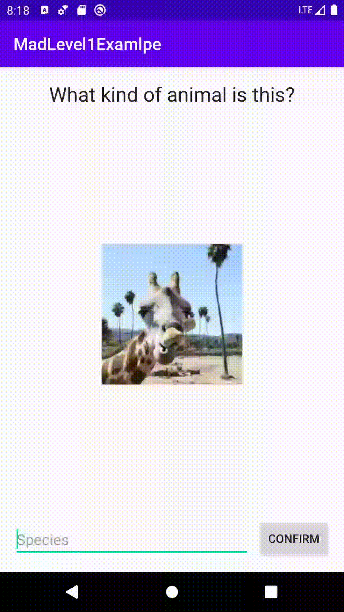
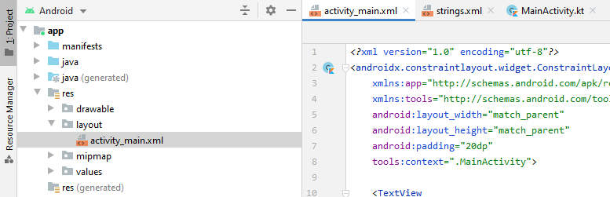
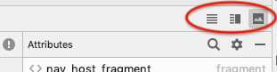
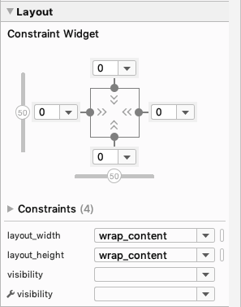

author: HvA
summary: Mad Level 1 Example
id: level1-example
categories: Apps
tags: apps
status: Published
feedback link: https://github.com/pmeijer-hva/mad-codelabs/issues
analytics account: UA-180951198-1

# MAD Level 1 - Example

## Overview

### Requirements

The client needs a simple quiz that presents a picture and asks the user what kind of animal is displayed.

### Solution

<br>

In this course you will find the necessary steps to build this app. If you encounter problems you
can always check [Github](https://github.com/Marcellis/MadLevel1Example) where you can find the whole solution.


## Create your first project 

### Android Studio

Firstly, download and install [Android Studio](https://developer.android.com/studio).  

"Start a new Project":

1. Select the ‘Empty Activity’.
2. Name the ‘MadLevel1Example’.
3. Choose language ‘Kotlin’.
4. Choose API 23.
5. Press finish getting started.

We want you to have every example and task on Gitlab with make to see that you are making frequent commits so at
this stage you should also add the project to Gitlab.  The process is not as straightforward as using Github because 
you need to create the Gitlab project and then link it using the URL.  
You can follow this short [tutorial](https://suragch.medium.com/how-to-add-an-android-studio-project-to-gitlab-b4318e19fe7c)

### Emulator

The app needs to run either on an [emulator](https://developer.android.com/studio/run/emulator.html) or a real device. It is preferred to use a real device. To use a real device you will need to attach the device to your computer and configure the device for Android development. Instructions for this can be found [here](https://developer.android.com/studio/debug/dev-options).
This is the best option if you do not have a high spec machine to develop your code.
The emulator can be very slow but is a good option if you have a fast machine or don't have an Android device.

Positive
: Run the app to validate that the emulator and Android SDK are working properly.

### Adding assets to the project

We will need to add an image to the app. You can find it [here](https://docs.google.com/uc?export=download&id=1_y5IhZQpKWl3rfybf47ugyYEDbYxCpIz). 
Download the zip file and extract the image. Images need to be stored in a specific place. 
In your project expand the ``res`` directory (resources) and then right-click on drawable inside res. 
On right-clicking you will see ```'Reveal in Explorer (or Finder)'```. Click on this and 
then drag or copy your downloaded image into the drawable folder (not into ``drawable-v24``).

## Build the layout



In `activity_main.xml`, we will see our first widget: a `TextView`. This widget is used to display text.

On the top right in Android Studio you have three options to view the properties of everything in the layout.
It can either be visually, textually or a combination of the two. Try it out!

<br>

### Constraining widgets

In text mode, if you look at the `TextView` you can see it is "constrained" through the following XML attributes:

``` xml
app:layout_constraintBottom_toBottomOf="parent"
app:layout_constraintLeft_toLeftOf="parent"
app:layout_constraintRight_toRightOf="parent"
app:layout_constraintTop_toTopOf="parent"
```

You can constrain the top, bottom, left, and right of a view to the top, bottom, left, and right of 
widgets in a so called `ConstraintLayout`.

Then try to constrain the `TextView` so that it is positioned like the screenshot we saw earlier
     
<br>

### Changing attributes of the widgets

<br><br>

Switch back to the visual mode and look for the `Attributes` area. 
First, try to change to `text` attribute of the `TextView` to:

`What kind of animal is this?`

Negative
: For now the text is hard-coded, we will fix this in the next section!

The second widget is an `ImageView` which can show an Image. The `src` is set to 
`@drawable/image1` which means the ImageView will display this image. 
Constrain the image to the start, end of the parent and the bottom of the `TextView`.  

The third widget is an `EditText`(input field). This `EditText` is constrained to 
the start and bottom of the parent. Constrain the imageview to the top of the EditText. 
`id` is `etAnswer`. 

Negative
: If `EditText is` not available, make sure you use `minSdkVersion 23`, 
you can change this in the `app/build.gradle` file. Don't forget to click "Sync now".

The last widget is a `Button`. Constrain the button to the end and bottom of the parent. 
The end of the EditText is constrained to the start of the Button. Button has been given the 
id `btnConfirm`.

Positive
: Struggling with your first layout? Check out the solution of this app on [Github](https://github.com/Marcellis/MadLevel1Example).

### strings.xml

There are some notifications about hardcoded strings. Solve these errors by replacing the harcoded strings
with reference to the `strings.xml` file:

``` xml
<string name="giraffe">Giraffe</string>
<string name="correct">Correct!</string>
<string name="incorrect">Incorrect, the correct answer is Giraffe!</string>
```

Then you can reference a key from this file like this: `R.string.giraffe`.

## Building the Activity

### Enable view binding

The first two levels in this course make use of View Binding. To enable View Binding in the project, 
change the following in the `app/build.gradle` file.

```bash
android {
    ...
    buildFeatures {
        viewBinding = true
    }
}

```

After this change, don’t forget to select “Sync Now”.

### The `onCreate(..)` Method

Wire up the checkAnswer method to the Button widget by setting an OnClickListener to it.

``` kotlin

private lateinit var binding: ActivityMainBinding

override fun onCreate(savedInstanceState: Bundle?) {
   super.onCreate(savedInstanceState)
   binding = ActivityMainBinding.inflate(layoutInflater) 
   setContentView(binding.root) // Sets the activity layout resource file. 

   // Using the id given in the layout file you can access the component.
   // Set an action when the user clicks on the confirm button.
   binding.btnConfirm.setOnClickListener {
       checkAnswer()
   }
}
```

The `onCreate` method is the method that is called when an `Activity` is created (started). 
Here you need to declare the initializations for the activity. In the generated `MainActivity` 
class the onCreate method is already overridden. The connection with the layout file is 
also made using setContentView. 

The submit button needs an `onClickListener` to detect when a user clicks the 
button and to define what to do when a user has clicked the button. Here the 
`checkAnswer` method is called when the button is clicked.

The binding object declared above the `onCreate` method refers to a class that is 
automatically generated when using `View Binding`. This class is generated when View Binding 
is enabled and the layout file contains a context linking the layout file with its accompanying class.
This generated class contains a mapping of all the variables with an id that are defined in the 
layout file.


### Checking user input

Create a method called `checkAnswer`
- When the text in the `EditText` equals the word “giraffe” a `Toast` message is displayed 
informing the user they are correct.
- When the text in the `EditText` does not equals the word “giraffe” a Toast message is displayed
 informing the user they are incorrect.
 
``` kotlin
/**
 * Check if the submitted answer is correct.
 */
private fun checkAnswer() {
    val answer = binding.etAnswer.text.toString()

    // When the answer equals "giraffe" then display a correct message using a toast message.
    // Otherwise display an incorrect message.
    val message = if (answer == getString(R.string.giraffe)) {
        getString(R.string.correct)
    } else {
        getString(R.string.incorrect)
    }

    Toast.makeText(this, message, Toast.LENGTH_LONG).show()
}
```

In Kotlin, methods are defined using the `fun` keyword. As with the variables, the return type is 
defined using the `:` after the method. The default return type is `Unit` which corresponds 
to `void` in Java. 

In Kotlin variables are created using either `val` or `var`.
- `val`: indicates that the variable is immutable (`final`).
- `var`: indicates that the variable is mutable (can be changed).

A widget is referenced in Kotlin using the binding object, and the ID we gave the widget in the 
layout file. The meaning of the binding object will be further explained in the next section.
A variable of type `val` is made which contains the current text from the `EditText` widget.

The method `getString(..)` is used to retrieve a `String` from the `strings.xml` resource file from an 
`Activity`. 

A `Toast` message is made using `Toast.makeText` using the `Context` (the Activity), 
a `String` for the message and a Length.

## Finishing your app!

Congratulations🎉, you completed your first app for this level!

Per level there are three apps and as we said at the beginning of this tutorial, each app should be in  **its own** 
Githlab repository. When you have done all
the levels you'll end up with 21 repositories.
Make sure that your version of this example is committed on Gitlab. 
