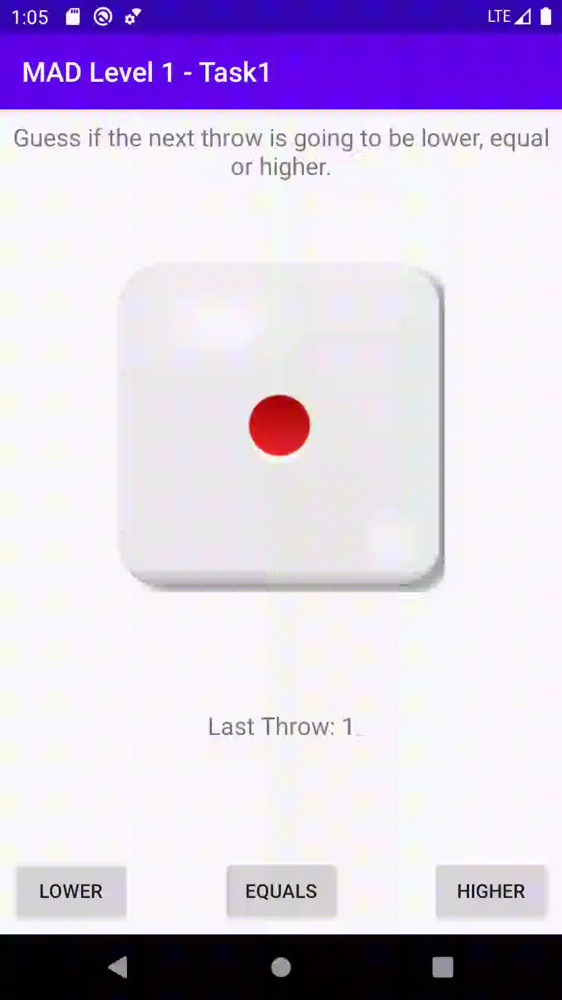

author: HvA
summary: Mad Level 1 - Task 1
id: level1-task1
categories: Apps
tags: apps
status: Published
feedback link: https://github.com/pmeijer-hva/mad-codelabs/issues
analytics account: UA-180951198-1


# MAD Level 1 - Task 1

## Overview

### Requirements

The user has to guess if the next number of the dice is higher, equal or lower than the current number.
* The dice throw should be randomly generated.
* The user gets informed about winning or losing.
* The last throw is registered in a textview.

### Solution

<br>

In this course you will find the necessary steps to build this app. If you encounter problems you
can always check [Github](https://github.com/Marcellis/MadLevel1Task1) where you can find the whole solution.


## Setup a new project

We’ll start this tutorial by creating a new Android Studio project.
Once you have successfully downloaded and installed Android Studio you need to ‘Start a new Project’.
1. Select the ‘Empty Activity’. 
2. Name the application ‘MadLevel1Task1’
3. Choose API 23
4. Choose language ‘Kotlin’
5. Press finish to get started.

### Enable viewbinding

Just like the example, make sure to enable viewbinding in `app.gradle`

### Import drawables

Next up is adding our images. You can find these [here](https://docs.google.com/uc?export=download&id=1DW5Gm6WXwf5b_V9t9-9ra7UJO6LkPFQJ). 

Positive
: The drawable folder is where image resources are stored. The Android Framework will generate 
IDs for the image placed in this folder. These are stored in a file called `R.java`, 
and can be referenced in Activities and other resource files (e.g. layout file). 
The id for dice1.png is `R.drawable.dice1`.

## Build the layout

First rename the `MainActivity` to `HigherLowerActivity` (use Right click on file -> Refactor -> Rename), also rename the layout file to `activity_higher_lower.xml`.
 
Now, create the layout in `activity_higher_lower.xml`. Open the layout file located in `res/layout` and build the layout as mentioned in the requirements completely 
by yourself using the design editor (you can do this!).

Otherwise check the solution for the correct XML file.


## Build the initial state of the screen

Start by adding the binding object variable to the class similar to how it was done in the example assignment. 

Positive
: This time the binding has a type of `ActivityHigherLowerBinding`. The name of this generated class has changed, 
because we refactored the name of the layout file to `activity_higher_lower.xml` in the previous step. 

Then add two `Int` variables to the `HigherLowerActivity` called `currentThrow` and `lastThrow` and initialize them with `1`.


```kotlin
class HigherLowerActivity : AppCompatActivity() {

   private lateinit var binding: ActivityHigherLowerBinding
   private var currentThrow: Int = 1
   private var lastThrow: Int = 1

 ...

}
```

We will be using `currentThrow` to keep track of the current dice number and `lastThrow` of the previous dice number. The variables 
have the keyword var because we want to be able to change them. They are initialized with value 1 which means that the first throw will be 1.

Positive
: Reminder: In kotlin properties and fields can be declared using the var and val keywords. 
Var is used for fields that are mutable, i.e. they can be initialized multiple times. Val is used for 
immutable fields, i.e. they can and must be initialized once (think of final in Java). 
The field type is declared using after a colon. Kotlin uses slightly different keywords than Java for variable types. 
For more information on the field types used in kotlin reference the following [link](https://kotlinlang.org/docs/reference/basic-types.html)


### Initial state

When the user first opens the app the app must display the first dice.

First, create a method called `updateUI()`. This methode will set the text for the last throw and the 
`ImageView` with the current throw dice image (use the variables created in the previous step).

The method updateUI is responsible for updating the widgets using the `currentThrow` and `lastThrow` variables. To change 
the image from the `ImageView` we use `setImageResource(..)` with the drawable. A `when` statement is used to find the 
corresponding image with the currentThrow. A when statement is like a switch statement in Java. 
More information can be found [here](https://kotlinlang.org/docs/reference/control-flow.html).

Second, a method called `initViews()` is also made which is responsible for setting up the first state of the user interface.
We will add some more initializations later. This method is added to 
the `onCreate(..)` so that it gets called once the activity is created.

```kotlin
class HigherLowerActivity : AppCompatActivity() {

   private lateinit var binding: ActivityHigherLowerBinding
   private var currentThrow: Int = 1
   private var lastThrow: Int = 1

   override fun onCreate(savedInstanceState: Bundle?) {
       super.onCreate(savedInstanceState)
       binding = ActivityHigherLowerBinding.inflate(layoutInflater)
       setContentView(binding.root)
       initViews()
   }

   /**
    * Set the initial (UI) state of the game.
    */
   private fun initViews() {
       updateUI()
   }

   /**
    * Update the last throw text and the dice image resource drawable with the current throw.
    */
   private fun updateUI() {
       binding.tvLastThrow.text = getString(R.string.last_throw, lastThrow)
   }
}
```

The text is set using the Strings resource file. String accessed from the `strings.xml` 
can also be given parameters. The `last_throw` String has a 
placeholder called `%d` which indicates that a digit parameter has to be given to it.

Overview of the `strings.xml` file after completing this step:
```xml
<resources>
   <string name="app_name">Higher Lower Kotlin</string>
   <string name="title">Guess if the next throw is going to be lower, equal or higher.</string>
   <string name="last_throw">Last Throw: %d</string>
   <string name="higher">Higher</string>
   <string name="equals">Equals</string>
   <string name="lower">Lower</string>
   <string name="dice">Dice</string>
   <string name="correct">Correct</string>
   <string name="incorrect">Incorrect</string>
</resources>
```

## Dice rolling logic

### Randomizing a dice roll

When a user clicks on the higher, equals or lower button the dice needs to be rerolled. 
Create a method called `rollDice()` which sets the last throw to the current dice and generates a new dice randomly. 
It doesn’t have to be wired to the buttons yet. 

```kotlin

/**
* Replaces the previous dice value with the current one and replaces the current dice with a new dice
* with a random number between 1 and 6 (inclusive).
*/
private fun rollDice() {
   lastThrow = currentThrow
   currentThrow = (1..6).random()
   updateUI()
}

```

Positive
: In this code snippet the (1..6).random() call makes use of Kotlin Ranges which makes a range of 1 to 6 (inclusive).

### Higher, equals and lower functionality

When the user clicks on one of these buttons the dice needs to be rolled and a check needs to be done to see if 
the user guessed correctly. When an answer is correct a `Toast` message should be shown with the text `“Correct”`. 
When an answer is incorrect a Toast message should be shown with the text `“Incorrect”`.

1. Create a method called `onAnswerCorrect` which should show a correct message (Toast) to the user
2. Create a method called `onAnswerIncorrect` which should show an incorrect message (Toast) to the user
3. Create a method called `onHigherClick` which should roll the dice and check if the answer is correct
4. Create a method called `onLowerClick` which should roll the dice and check if the answer is correct
5. Create a method called `onEqualClick` which should roll the dice and check if the answer is correct

```kotlin
/**
* Calls [rollDice] and checks if the answer is correct.
*/
private fun onHigherClick() {
   //Implement this function yourself!
}

/**
* Calls [rollDice] and checks if the answer is correct.
*/
private fun onLowerClick() {
   //Implement this function yourself!
}

/**
* Calls [rollDice] and checks if the answer is correct.
*/
private fun onEqualClick() {
   //Implement this function yourself!
}

/**
* Displays a successful Toast message.
*/

private fun onAnswerCorrect() {
   //Implement this function yourself!
}

/**
* Displays an incorrect Toast message.
*/
private fun onAnswerIncorrect() {
   //Implement this function yourself!
}

```

Positive
: Currently these methods aren’t connected to the buttons, this will be done in the next step.

### Adding Click Listeners to the buttons

The methods that are needed for the functionalities of this app have now been made but they are never called. 
`onClickListeners` need to be added to the buttons. Do this inside the initViews method created earlier. 

```kotlin

/**
* Add onClickListeners to the higher, lower and reset buttons.
* Set the initial (UI) state of the game.
*/
private fun initViews() {
   //Implement the clicklisteners yourself
   updateUI()
}

```

## Pushing to Github!

Congratulations🎉, you completed your second app of this level! Push it to Github!