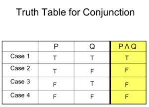

author: HvA
summary: MAD Level 1 - Task 2 
id: level1-task2
tags: apps
categories: Apps
status: Published
feedback link: https://github.com/pmeijer-hva/mad-codelabs/issues
analytics account: UA-180951198-1

# MAD Level 1 - Task 2

## Overview

### Truth table app

We need to make an app in which the knowledge of the user for the truth table of conjunction is tested. It should be a 
quiz in which the user is only allowed to fill in `“T”` or `“F”` (true or false). When all input fields are filled in, the user 
should click on the submit button to see how many answers are correct. This should be done with a Toast message. 
The user can try again until all the answers are right. The layout file should be built with a `ConstraintLayout`.

 

### You're on your own!

Task 2 of each level doesn't provide you a solution nor step by step guidance. 
When you are done, push to Github! 💥