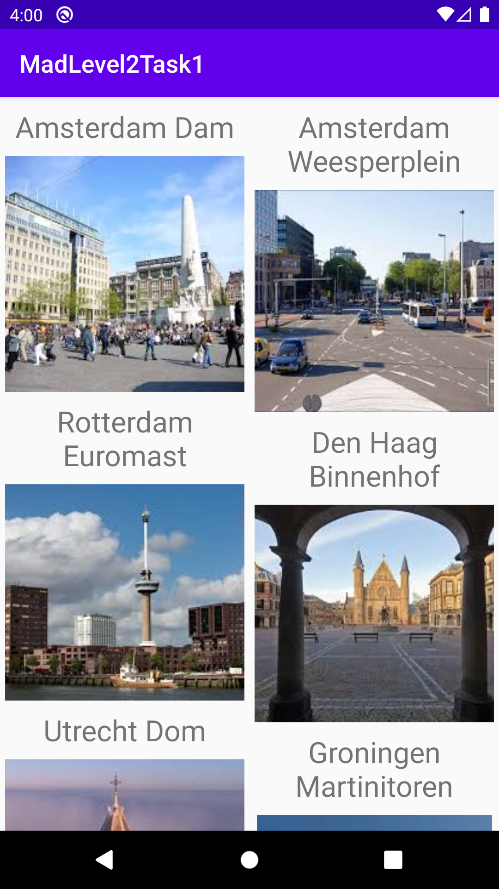

author: HvA
summary: Mad Level 2 - Task 1
id: level2-task1
categories: Apps
tags: apps
status: Published
feedback link: https://github.com/pmeijer-hva/mad-codelabs/issues
analytics account: UA-180951198-1

# MAD Level 2 - Task 1

## Overview

### Requirements

We need to build an app to make up a list of places. 

<br>

### Solution

If you encounter problems you can always check the [solution](https://gitlab.fdmci.hva.nl/android-app-development1/february-2021/ian_bradford/madlevel2task1) for the whole solution.

### Setup a new project

Make sure once you get started with this example the following steps were taken in advance: 

1. Select the ‘Empty Activity’.
2. Name the ‘MadLevel2Task1’.
3. Choose language ‘Kotlin’.
4. Choose API 23.
5. Press finish to get started.


You can find the images [here](https://docs.google.com/uc?export=download&id=1B_vufZWXvV_I79FlTdlP9I-ehkCMByaO). 

## Setting up the Model and Adapter

### Create a place model

Create a new data class and call it `Place`. A place has a name and an image resource id.

``` kotlin
data class Place(
   var name: String,
   @DrawableRes var imageResId: Int
)
```

This class will be the data model for each object that will be shown in the RecyclerView. 
The `imageResId` has been annotated with `@DrawableRes` which indicates to Android 
we expect this variable to be a Drawable Resource Id.

Create an array of Place objects.

``` kotlin

data class Place(
    var name: String,
    @DrawableRes var imageResId: Int
) {
    companion object {

        val PLACES = arrayOf(
        Place("Amsterdam Dam",R.drawable.amsterdam_dam),
        Place("Amsterdam Weesperplein",R.drawable.amsterdam_weesperplein),
        Place("Rotterdam Euromast",R.drawable.rotterdam_euromast),
        Place("Den Haag Binnenhof",R.drawable.den_haag_binnenhof),
        Place("Utrecht Dom",R.drawable.utrecht_dom),
        Place("Groningen Martinitoren",R.drawable.groningen_martinitoren),
        Place("Maastricht Vrijthof",R.drawable.maastricht_vrijthof),
        Place("New York Vrijheidsbeeld",R.drawable.new_york_vrijheidsbeeld),
        Place("San Francisco Golden Gate",R.drawable.san_francisco_golden_gate),
        Place("Yellowstone Old Faithful",R.drawable.yellowstone_old_faithful),
        Place("Yosemite Half Dome",R.drawable.yosemite_half_dome),
        Place("Washington White House",R.drawable.washington_white_house),
        Place("Ottawa Parliament Hill",R.drawable.ottawa_parliament_hill),
        Place("Londen Tower Bridge",R.drawable.london_tower_bridge),
        Place("Brussel Manneken Pis",R.drawable.brussel_manneken_pis),
        Place("Berlijn Reichstag",R.drawable.berlijn_reichstag),
        Place("Parijs Eiffeltoren",R.drawable.parijs_eiffeltoren),
        Place("Barcelona Sagrada Familia",R.drawable.barcelona_sagrada_familia),
        Place("Rome Colosseum",R.drawable.rome_colosseum),
        Place("Pompeii",R.drawable.pompeii),
        Place("Kopenhagen",R.drawable.kopenhagen),
        Place("Oslo",R.drawable.oslo),
        Place("Stockholm",R.drawable.stockholm),
        Place("Helsinki",R.drawable.helsinki),
        Place("Moskou Rode Plein",R.drawable.moskou_rode_plein),
        Place("Beijing Verboden Stad",R.drawable.beijing_verboden_stad),
        Place("Kaapstad Tafelberg",R.drawable.kaapstad_tafelberg),
        Place("Rio de Janeiro Copacabana",R.drawable.rio_de_janeiro_copacabana),
        Place("Sydney Opera",R.drawable.sydney_opera),
        Place("Hawaii Honolulu",R.drawable.hawaii),
        Place("Alaska Denali",R.drawable.alaska_denali)


        )
    }

}
```
Positive
: In Kotlin arrays are defined using arrayOf() and static types are defined within a companion object. [More info](https://kotlinlang.org/docs/tutorials/kotlin-for-py/objects-and-companion-objects.html) 

## Creating a cell layout

Create a new XML layout file in the layout directory of your `res` directory, 
call it `item_place`. Add a `TextView` and an `ImageView` which represents a single item within the `RecyclerView`.
This layout file will be used for each item within the RecyclerView. 
It has a `TextView` which displays the name of the place and below it holds an `ImageView` which displays the image of the place. 
The ImageView has the property `android:scaleType=”centerCrop”` for better visuals.

``` xml
<?xml version="1.0" encoding="utf-8"?>
<androidx.constraintlayout.widget.ConstraintLayout xmlns:android="http://schemas.android.com/apk/res/android"
    xmlns:app="http://schemas.android.com/apk/res-auto"
    xmlns:tools="http://schemas.android.com/tools"
    android:layout_width="match_parent"
    android:layout_height="wrap_content"
    android:paddingStart="4dp"
    android:paddingEnd="4dp">

    <TextView
        android:id="@+id/tvPlace"
        android:layout_width="0dp"
        android:layout_height="wrap_content"
        android:padding="8dp"
        android:text="TextView"
        android:textAlignment="center"
        android:textSize="24sp"
        app:layout_constraintEnd_toEndOf="parent"
        app:layout_constraintStart_toStartOf="parent"
        app:layout_constraintTop_toTopOf="parent" />

    <ImageView
        android:id="@+id/ivPlace"
        android:layout_width="wrap_content"
        android:layout_height="wrap_content"
        android:scaleType="centerCrop"
        app:layout_constraintEnd_toEndOf="parent"
        app:layout_constraintStart_toStartOf="parent"
        app:layout_constraintTop_toBottomOf="@+id/tvPlace"
        tools:srcCompat="@tools:sample/avatars" />
</androidx.constraintlayout.widget.ConstraintLayout>
```

## Creating a PlaceAdapter

- Create a class called `PlaceAdapter`. 
- Add an `inner class` ViewHolder
- Within the ViewHolder `bind` the image and name to the ImageView and TextView using kotlin synthetics.  
- Add an `ArrayList` of type `Place` to the class constructor.
- Let the `PlaceAdapter` extend `RecyclerView.ViewHolder` and implement the methods.

## Setting up the MainActivity

The last thing we need to do before we can run our app is to wire the adapter to the RecyclerView in the MainActivity.
- Create and initialize an `ArrayList` of Place objects and a PlaceAdapter
- Create a method called `initViews` and call it in the onCreate of the MainActivity
- In initViews set the layout manager (StaggeredGridLayoutManager) and adapter of the RecyclerView. 

Populate the places list and notify the data set has changed using the next code:

```kotlin 
  places.addAll(Place.PLACES)
  placeAdapter.notifyDataSetChanged()
```

After the `ArrayList` has been populated the adapter will be notified(`notifyDataSetChanged()`) that the data set has been changed.

Congratulations🎉, you completed your second recyclerview application!

Push the App to GitLab! 
