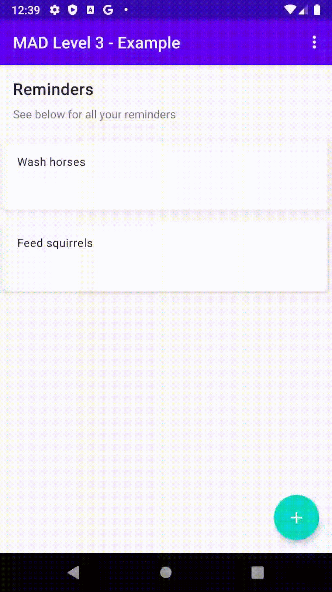
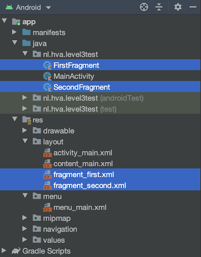
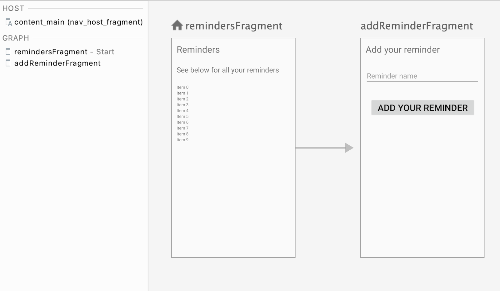

author: HvA
summary: Mad Level 3 Example
id: level3-example
categories: Apps
tags: apps
status: Published
feedback link: https://github.com/pmeijer-hva/mad-codelabs/issues
analytics account: UA-180951198-1

# MAD Level 3 - Example

## Overview

### Requirements

We will be moving the adding of a reminder to a separate fragment. See the GIF below for the end result:

<br>

### Solution 

In this course you will find the necessary steps to build this app. If you encounter problems 
you can always check the [github](https://github.com/Marcellis/madlevel3example) where you can find the whole solution.

## Create a new project

### Using a different project template
We’ll start this tutorial by creating a new Android Studio project. We’ll use a different template from now on. In Android Studio:

1. ‘Start a new project’.
2. Select the ‘Basic Activity’. 
3. Name the application ‘MadLevel3Example’.
4. Choose API 23.
5. Choose language ‘Kotlin’.
6. Press finish to get started.

### Edit your app/build.gradle

We will be using a new release of the fragment dependency. Add the following dependency in `app/build.gradle` like so:

``` kotlin
def fragment_version = "1.3.0-alpha06"
implementation "androidx.fragment:fragment-ktx:$fragment_version"
```

We will also be using view binding for this example, so enable this.

## Some refactoring

By picking the `Basic Activity` option when creating a project, Android generates an activity and two [fragments](https://developer.android.com/guide/components/fragments) for us. 
A Fragment represents a behavior or a portion of the user interface. The idea is that an activity can hold multiple fragments. 
We can navigate between these fragments with the [navigation component](https://developer.android.com/guide/navigation). 

To use this boilerplate code for our project we need to alter some things.

<br>

Renaming files:

-  Right click → Refactor → Rename  `FirstFragment` to `RemindersFragment` and `SecondFragment` to `AddReminderFragment`

-  Do the same for the two selected layout files shown on the image (with proper name conventions - the names of the xml files and their corresponding Kotlin files show you the naming conventions - also see the Naming Conventions link in the Resources section for this level)

We also need to clean up the fragments, make the following changes:

-  Remove the `Button` and the `TextView` from both fragments’ layouts. Also remove the `clicklistener` in the Fragment classes

-  We chose a Basic Activity and this gives us a floating action button (FAB) by default.  
You might have noticed that there are also two layout files related to the main activity.  
The two files are: `activity_main.xml` and `content_main.xml`.  
If you examine the xml for both of these files you will see that `activity_main.xml` contains the `FAB` and also has a line:

``` xml
<include layout="@layout/content_main" />.
```

You should build your layout in the `content_main.xml` file.  

We need to change the image on the `FAB`.  In `activity_main.xml` change the line to: 

``` xml
app:srcCompat="@android:drawable/ic_input_add" />
```
and add: 

``` xml
android:tint="@android:color/white"
```

to change the plus sign colour to white. 

Positive
: If you stay in the Design tab, you can also change this in “Attributes”, 
by selecting the dropdown behind `srcCompat` and selecting `ic_input_add`, 
and for “tint” select `@android:color/white`.

## User interface (xml files)

Change the layout of `RemindersFragment` and `AddReminderFragment` so that it matches the GIF displayed within the overview section. 
In the `fragment_reminders.xml` add the `TextViews` and the `RecyclerView` and constrain these properly. 
And similar for `fragment_add_reminder.xml`. Also create file `item_reminder.xml`, representing the elements in the recyclerview as we did before. 
`Fragment_reminders.xml` and `fragment_add_reminder.xml` should be modified by using the Design editor. `item_reminder.xml` 
will be modified below. The resulting code should be similar to that shown below. 
Keep in mind that the names of the variables are also used in the Kotlin code afterwards.

### Strings.xml

``` xml
<resources>
   ……..
   <string name="reminders">Reminders</string>
   <string name="see_below">See below for all your reminders</string>
   <string name="add_your_reminder">Add your reminder</string>
   <string name="reminder_name">Reminder name</string>
   <string name="not_valid_reminder">Invalid reminder</string>
</resources>
```

### Fragment_reminders.xml

``` xml
<?xml version="1.0" encoding="utf-8"?>
<androidx.constraintlayout.widget.ConstraintLayout xmlns:android="http://schemas.android.com/apk/res/android"
   xmlns:app="http://schemas.android.com/apk/res-auto"
   xmlns:tools="http://schemas.android.com/tools"
   android:layout_width="match_parent"
   android:layout_height="match_parent"
   tools:context=".RemindersFragment">

   <TextView
       android:id="@+id/textView2"
       android:layout_width="0dp"
       android:layout_height="wrap_content"
       android:padding="16dp"
       android:text="@string/reminders"
       android:textSize="30sp"
       app:layout_constraintEnd_toEndOf="parent"
       app:layout_constraintStart_toStartOf="parent"
       app:layout_constraintTop_toTopOf="parent" />

   <TextView
       android:id="@+id/textView3"
       android:layout_width="0dp"
       android:layout_height="wrap_content"
       android:padding="16dp"
       android:text="@string/see_below"
       android:textSize="24sp"
       app:layout_constraintEnd_toEndOf="parent"
       app:layout_constraintStart_toStartOf="parent"
       app:layout_constraintTop_toBottomOf="@+id/textView2" />

   <androidx.recyclerview.widget.RecyclerView
       android:id="@+id/rvReminders"
       android:layout_width="0dp"
       android:layout_height="0dp"
       android:padding="16dp"
       app:layout_constraintBottom_toBottomOf="parent"
       app:layout_constraintEnd_toEndOf="parent"
       app:layout_constraintStart_toStartOf="parent"
       app:layout_constraintTop_toBottomOf="@+id/textView3" />
</androidx.constraintlayout.widget.ConstraintLayout>
```

### Fragment_add_reminder.xml

``` xml
<?xml version="1.0" encoding="utf-8"?>
<androidx.constraintlayout.widget.ConstraintLayout xmlns:android="http://schemas.android.com/apk/res/android"
   xmlns:app="http://schemas.android.com/apk/res-auto"
   xmlns:tools="http://schemas.android.com/tools"
   android:layout_width="match_parent"
   android:layout_height="match_parent"
   tools:context=".AddReminderFragment">

   <TextView
       android:id="@+id/textView"
       android:layout_width="0dp"
       android:layout_height="wrap_content"
       android:padding="16dp"
       android:text="@string/add_your_reminder"
       android:textSize="30sp"
       app:layout_constraintEnd_toEndOf="parent"
       app:layout_constraintStart_toStartOf="parent"
       app:layout_constraintTop_toTopOf="parent" />

   <com.google.android.material.textfield.TextInputLayout
       android:id="@+id/textInputLayout"
       android:layout_width="409dp"
       android:layout_height="wrap_content"
       android:padding="16dp"
       app:layout_constraintStart_toStartOf="parent"
       app:layout_constraintTop_toBottomOf="@+id/textView">

       <com.google.android.material.textfield.TextInputEditText
           android:id="@+id/etReminderName"
           android:layout_width="match_parent"
           android:layout_height="wrap_content"
           android:hint="@string/reminder_name"
           android:textSize="24sp" />
   </com.google.android.material.textfield.TextInputLayout>

   <Button
       android:id="@+id/btnAddReminder"
       android:layout_width="0dp"
       android:layout_height="wrap_content"
       android:layout_margin="32dp"
       android:text="@string/add_your_reminder"
       android:textSize="30sp"
       app:layout_constraintEnd_toEndOf="parent"
       app:layout_constraintStart_toStartOf="parent"
       app:layout_constraintTop_toBottomOf="@+id/textInputLayout" />
</androidx.constraintlayout.widget.ConstraintLayout>
```

### item_reminder.xml

We also want to use a nice `CardView` for the `RecyclerView` items. In the previous level we used a `ConstraintLayout` for this, 
however this isn’t optimal for the ReyclerView from a performance perspective. Therefore, you can use the following XML:

``` xml
<?xml version="1.0" encoding="utf-8"?>
<androidx.cardview.widget.CardView
xmlns:android="http://schemas.android.com/apk/res/android"
xmlns:card_view="http://schemas.android.com/apk/res-auto"
android:id="@+id/card_view"
android:layout_width="match_parent"
android:layout_height="100dp"
android:layout_gravity="center"
card_view:cardCornerRadius="4dp"
card_view:cardElevation="4dp"
card_view:cardUseCompatPadding="true">

<TextView
   android:id="@+id/tvReminder"
   android:layout_margin="16dp"
   style="@style/TextAppearance.MaterialComponents.Body2"
   android:layout_width="match_parent"
   android:layout_height="match_parent" />
</androidx.cardview.widget.CardView>
```

## Kotlin code and navigation

### Data model and adapter

You can reuse the `adapter` and `model` from the previous level ( [Level 2 Example](https://github.com/Marcellis/MadLevel2Example/tree/master/app/src/main/java/com/example/madlevel2example) ). 
So copy and paste `Reminder.kt` and `ReminderAdapter.kt`.

Using view binding in fragments has to be set up a bit different than in activities. Instead of binding the view in the `onCreate(..)`
method, this will be done in the `onCreateView(..)` method, as shown below.

```kotlin
class RemindersFragment : Fragment() {

    private var _binding: FragmentRemindersBinding? = null
    private val binding get() = _binding!!

    override fun onCreateView(
        inflater: LayoutInflater, container: ViewGroup?,
        savedInstanceState: Bundle?
    ): View {
        _binding = FragmentRemindersBinding.inflate(inflater, container, false)
        return binding.root
    }
    
    ...
}
```

Fragments outlive their views, this means that we need to clean up any references to the binding class instance of the fragment. We do this in the
fragment's `onDestroyView()` method.

```kotlin
override fun onDestroyView() {
    super.onDestroyView()
    _binding = null
}
```

As far as accessing these, coupling was previously done in the `MainActivity`, now you will have to do that in the `RemindersFragment`. 
The `onViewCreated(..)` method should be used instead of `onCreate(..)`.

First create two variables in `RemindersFragment`:

``` kotlin
private val reminders = arrayListOf<Reminder>()
private val reminderAdapter = ReminderAdapter(reminders)
```

and in `onViewCreated(..)` call the `initViews()` method.

``` kotlin
override fun onViewCreated(view: View, savedInstanceState: Bundle?) {
   super.onViewCreated(view, savedInstanceState)

   initViews()
}
```

The `initViews` method in the `RemindersFragment` will look like this.

```kotlin
private fun initViews() {
    // Initialize the recycler view with a linear layout manager, adapter
    binding.rvReminders.layoutManager =
        LinearLayoutManager(context, RecyclerView.VERTICAL, false)
    binding.rvReminders.adapter = reminderAdapter
    binding.rvReminders.addItemDecoration(
        DividerItemDecoration(
            context,
            DividerItemDecoration.VERTICAL
        )
    )
}
```

### Edit res/navigation/nav_graph.xml

First make sure that you have built the add reminder screen (see the image at the beginning of this tutorial) on the `fragment_add_reminder.xml`.
Navigation between fragments is defined by an xml file called `nav_graph.xml`.  
This can be seen in the directory `/res/navigation`.  This file contains all the definitions of fragments and the related navigation actions. 
The navigation component will parse this file and build a graph for the navigation flow. The file has already been generated because the basic activity uses fragments.  
Delete the existing `nav_graph.xml` file and then create a new one.  In the design view of the `nav_graph.xml` file add a new destination 
using the `New Destination` button and select `fragment_reminders`.  You will see that a view of the fragments reminders is displayed with a home symbol.  
Now add the other fragment.  Select the home fragment again and then drag to the `addReminderFragment` to create a navigation between the two.  
The end result looks like the screen below: 

<br>

### Create the add reminder screen layout

Open `MainActivity`, since the `FAB` is still in the activity we will put some of the navigation logic there. 
We’re going to see that we can either use the `navController` from an activity or a fragment. 
Make the following changes:

``` kotlin
private lateinit var navController: NavController
private lateinit var binding: ActivityMainBinding

override fun onCreate(savedInstanceState: Bundle?) {
    super.onCreate(savedInstanceState)
    binding = ActivityMainBinding.inflate(layoutInflater)
    setContentView(binding.root)
    setSupportActionBar(findViewById(R.id.toolbar))

    val navHostFragment =
        supportFragmentManager.findFragmentById(R.id.nav_host_fragment) as NavHostFragment

    navController = navHostFragment.navController

    binding.fab.setOnClickListener {
        navController.navigate(
            R.id.action_remindersFragment_to_addReminderFragment
        )
    }
}
```

The `NavController` manages the navigation within a `NavHost`, all fragments will be embedded into this placeholder fragment when navigating. 
Sort of like a stack of sheets that gets piled up over time. Our navhost is defined in the layout of the activity: `content_main.xml`. 
The `NavController` can only navigate between actions and fragments defined in the `nav_graph.xml` we saw earlier on.

In the `clickListener` we’re specifying the action we defined in step 4.1.

Run the app and you see that clicking on the `FAB` results in the Add Reminder Fragment being displayed. 
You will notice that the `FAB` is still visible.  This is because the Fragments are sort of swapped into the main screen at run time.   
If you try clicking the `FAB` when the Add Reminder Fragment is displayed it causes the application to crash.  
We need to hide the FAB when the Add Reminder Fragment is visible.  For this we’ll make a little helper method in the `MainActivity`:

``` kotlin
private fun fabToggler() {
    navController.addOnDestinationChangedListener { _, destination, _ ->
        if (destination.id in arrayOf(R.id.addReminderFragment)) {
            binding.fab.hide()
        } else {
            binding.fab.show()
        }
    }
}
```

Call the `fabToggler` method from the `onCreate` method: 

``` kotlin
private lateinit var navController: NavController
private lateinit var binding: ActivityMainBinding

override fun onCreate(savedInstanceState: Bundle?) {
    super.onCreate(savedInstanceState)
    binding = ActivityMainBinding.inflate(layoutInflater)
    setContentView(binding.root)
    setSupportActionBar(findViewById(R.id.toolbar))

    val navHostFragment =
        supportFragmentManager.findFragmentById(R.id.nav_host_fragment) as NavHostFragment

    navController = navHostFragment.navController

    binding.fab.setOnClickListener {
        navController.navigate(
            R.id.action_remindersFragment_to_addReminderFragment
        )
    }

    fabToggler()
}
```

Now test your code and see if it navigates to the add reminder screen without showing the `FAB`. 

### Implement add reminder logic

Add the following code to `AddReminderFragment.kt`:

``` kotlin
const val REQ_REMINDER_KEY = "req_reminder"
const val BUNDLE_REMINDER_KEY = "bundle_reminder"

class AddReminderFragment : Fragment() {

    private var _binding: FragmentAddReminderBinding? = null
    private val binding get() = _binding!!

    override fun onCreateView(
        inflater: LayoutInflater, container: ViewGroup?,
        savedInstanceState: Bundle?
    ): View {
        _binding = FragmentAddReminderBinding.inflate(inflater, container, false)
        return binding.root
    }

    override fun onViewCreated(view: View, savedInstanceState: Bundle?) {
        super.onViewCreated(view, savedInstanceState)

        binding.btnAddReminder.setOnClickListener {
            onAddReminder()
        }
    }
    
    override fun onDestroyView() {
        super.onDestroyView()
        _binding = null
    }

    private fun onAddReminder() {
        val reminderText = binding.etReminderName.text.toString()

        if (reminderText.isNotBlank()) {
            //set the data as fragmentResult, we are listening for REQ_REMINDER_KEY in RemindersFragment!
            setFragmentResult(REQ_REMINDER_KEY, bundleOf(Pair(BUNDLE_REMINDER_KEY, reminderText)))

            //"pop" the backstack, this means we destroy
            //this fragment and go back to the RemindersFragment
            findNavController().popBackStack()

        } else {
            Toast.makeText(
                activity,
                R.string.not_valid_reminder, Toast.LENGTH_SHORT
            ).show()
        }
    }
}
```

With our navigation actions in place we can add some logic to the `AddReminderFragment`.

First, set a `clickListener` on the button which calls a method called `onAddReminder()`.

Then in the `onAddReminder()` method we do three things:
1. Validate the user input.
2. Fragments are placed on a so-called `backstack`. This is a complex stack and it’s a difficult job to keep state
and pass data between these fragments. For fragments, we can use `setFragmentResult(..)` with the latest alpha version of the fragment dependency ([Step 2](https://mad-codelabs.azurewebsites.net/codelabs/level3-example/index.html?index=..%2F..index#1)). 
After submitting in the `AddReminderFragment` we can set an object (for us a String) wrapped in a `Bundle`. 
Later on we can listen for this result in the `RemindersFragment`. Also note we pass a `Pair` with the key and value, nice helper class of Kotlin!
3. Lastly, we “pop” the backstack. This removes the current fragment (`AddReminderFragment`) and brings us back to the `RemindersFragment`.

See this [link](https://developer.android.com/training/basics/fragments/pass-data-between) for more information about passing data between `Fragments`.


## Retrieve the reminder in the Reminders

The last step is to retrieve the Reminder object in the `RemindersFragment:`

``` kotlin
private fun observeAddReminderResult() {
    setFragmentResultListener(REQ_REMINDER_KEY) { _, bundle ->
        bundle.getString(BUNDLE_REMINDER_KEY)?.let {
            val reminder = Reminder(it)

            reminders.add(reminder)
            reminderAdapter.notifyDataSetChanged()
        } ?: Log.e("ReminderFragment", "Request triggered, but empty reminder text!")
    }
}
```
Here we are listening for the result which has been set in the `AddReminderFragment`. 
If the request is triggered we can get a bundle via the `BUNDLE_REMINDER_KEY`. 
When this is not null we will wrap it into a `Reminder` object, 
add it to our reminders list and give the adapter a heads up.

Finally, make sure to call this method inside `onViewCreated(..)`. You can run the app and the reminders 
should be added to the recyclerview list. 

## Remove reminder by swiping left

We have already created a `createItemTouchHelper` method in [Level 2 Example](https://mad-codelabs.azurewebsites.net/codelabs/level2-example/index.html?index=..%2F..index#5), 
we will also implement this in `RemindersFragment`:
-  Create a method called `createItemTouchHelper` and create an `ItemTouchHelper` object.
-  Implement the `ItemTouchHelper.SimpleCallBack` methods and let `onMove` return true and `onSwiped` 
should remove the item from the list and update the adapter.

```kotlin 
/**
 * Create a touch helper to recognize when a user swipes an item from a recycler view.
 * An ItemTouchHelper enables touch behavior (like swipe and move) on each ViewHolder,
 * and uses callbacks to signal when a user is performing these actions.
 */
private fun createItemTouchHelper(): ItemTouchHelper {

    // Callback which is used to create the ItemTouch helper. Only enables left swipe.
    // Use ItemTouchHelper.SimpleCallback(0, ItemTouchHelper.LEFT or ItemTouchHelper.RIGHT) to also enable right swipe.
    val callback = object : ItemTouchHelper.SimpleCallback(0, ItemTouchHelper.LEFT) {

        // Enables or Disables the ability to move items up and down.
        override fun onMove(
            recyclerView: RecyclerView,
            viewHolder: RecyclerView.ViewHolder,
            target: RecyclerView.ViewHolder
        ): Boolean {
            return false
        }

        // Callback triggered when a user swiped an item.
        override fun onSwiped(viewHolder: RecyclerView.ViewHolder, direction: Int) {
            val position = viewHolder.adapterPosition
            reminders.removeAt(position)
            reminderAdapter.notifyDataSetChanged()
        }
    }
    return ItemTouchHelper(callback)
}
```

- Attach the `ItemTouchHelper` to the recyclerView, do this in the `initViews` method.

``` kotlin
createItemTouchHelper().attachToRecyclerView(binding.rvReminders)
```
Now run the app, we are done!

***Push the app to your Github repository.***


