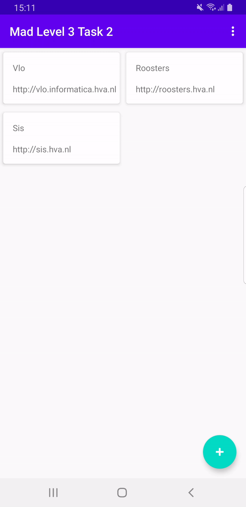

author: HvA
summary: MAD Level 3 - Task 2
id: level3-task2
tags: apps
categories: Apps
status: Published
feedback link: https://github.com/pmeijer-hva/mad-codelabs/issues
analytics account: UA-180951198-1

# MAD Level 3 - Task 2

## Requirements

We need to build an application where you can manage all the portals (websites) you need for your study: a recyclerview 
is used to manage this list. The other screen is responsible for adding a portal. The portals don’t currently need to be stored, 
that is something we will learn in the next level. This is an example of how the end result should look:

## Hints

To pass an object (`Portal`) to other Android components (in our case send the `Portal` object from one fragment to another) 
Android has created an implementation of Java’s `Serializable` which is called `Parcelable`. 
To make the Portal object `Parcelable` we will be using Kotlin’s `Parcelize` annotation. 

For more information: check this [link](https://developer.android.com/kotlin/parcelize). The `kotlin-parcelize` plugin is enabled by default.

We can now pass the `Portal object` from one fragment using a `Bundle`. Later on within the other fragment we can do a 
`setFragmentResultListener` and call `bundle.getParcelable<Portal>()`.

Clicking on a `Student Portal` should open the portal URL using [Custom Chrome Tabs](
https://developer.chrome.com/multidevice/android/customtabs).

How to implement a `clickListener` for a recyclerview can be found [here](
https://www.andreasjakl.com/recyclerview-kotlin-style-click-listener-android).

## Solution
Now, you are on your own. There is no solution provided. Good Luck!
Push the app to your GitLab Repository.
