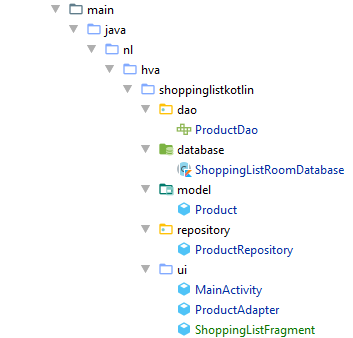

author: HvA
summary: Mad Level 4 - Task 1
id: level4-task1
categories: Apps
tags: apps
status: Published
feedback link: https://github.com/pmeijer-hva/mad-codelabs/issues
analytics account: UA-180951198-1

# MAD Level 4 - Task 1

## Overview

### Requirements

The user of the app should be able to add and delete shopping list items. The user can add items using the plus 
button and delete items by swiping them to the left. 

### Solution

Below you will find the necessary steps to build this app. If you encounter problems you can always 
[check](https://github.com/Marcellis/MadLevel4Task1) where you can find the whole solution.

// add gif

## Create the User Interface

To start, please build the user interface as defined in the image above. Normally you would have the `FloatingActionButton` 
in the `Activity`, now add two `FloatingActionButtons` to the bottom of the fragment! The layout of the `AlertDialog` will come later.

Since we have done that before (see for example Mad Level 3 Example), you should now be able to create the `ShoppingListAdapter` and interface with it.

## Configure Room database

### Gradle

Make the necessary changes in Gradle to be able to use `ROOM`.

### Create the Entity

Create a Product data class representing a shopping item. A product will have a quantity and a name.

### Create the Data Access Object (DAO)

- Create an interface class called ProductDao and annotate it with the annotation `@Dao`.
- For this application we need **four** methods. Insert a single product, delete one product, 
  delete all products and get all products.
- Annotate these methods with `@Insert`, `@Delete` and `@Query`. 

``` kotlin
@Dao
interface ProductDao {

   @Query("SELECT * FROM product_table")
   suspend fun getAllProducts(): List<Product>

   @Insert
   suspend fun insertProduct(product: Product)

   @Delete
   suspend fun deleteProduct(product: Product)

   @Query("DELETE FROM product_table")
   suspend fun deleteAllProducts()

}
```

In the [DAO](https://developer.android.com/training/data-storage/room/accessing-data.html) (data access object), you specify SQL queries and associate them with method calls. The compiler checks the SQL and generates queries from convenience annotations for common queries, such as @Insert. The Dao must be an interface or abstract class.

The methods contain the **suspend** keyword which means that they can’t be run outside a coroutine. 
Which ensures that they won’t be called from the main (ui) thread and cause screen freezes.

### Create the Room Database

- Create a `public abstract` class that extends `RoomDatabase` and call it `ShoppingListRoomDatabase`.
- Annotate the class to be a room database and declare the entities that belong in the database and set the version number. 
  `@Database(entities = [Product::class], version = 1, exportSchema = false)`
- Create the following field to define that this is a `DAO` that works with this database: 
`abstract fun productDao(): ProductDao`
- Make the database a `singleton` to prevent having multiple instances of the database opened at the same time.

``` kotlin
@Database(entities = [Product::class], version = 1, exportSchema = false)
abstract class ShoppingListRoomDatabase : RoomDatabase() {

   abstract fun productDao(): ProductDao

   companion object {
       private const val DATABASE_NAME = "SHOPPING_LIST_DATABASE"

       @Volatile
       private var shoppingListRoomDatabaseInstance: ShoppingListRoomDatabase? = null

       fun getDatabase(context: Context): ShoppingListRoomDatabase? {
           if (shoppingListRoomDatabaseInstance == null) {
               synchronized(ShoppingListRoomDatabase::class.java) {
                   if (shoppingListRoomDatabaseInstance == null) {
                       shoppingListRoomDatabaseInstance =
                           Room.databaseBuilder(context.applicationContext,ShoppingListRoomDatabase::class.java, DATABASE_NAME).build()
                   }
               }
           }
           return shoppingListRoomDatabaseInstance
       }
   }

}
```

Using the `@Database` annotation Room knows that this call is a `RoomDatabase`. 
Here the entities that should be stored in this database are also defined.

An abstract method is available to retrieve an implementation of the `ProductDao` Room provides us with is also made.

The database is made within a companion object to make it static. 
The database is also a `Singleton` to prevent there being multiple instances of the database because creating such an instance is heavy work.

The actual database is constructed using the `databaseBuilder` from Room.

`Room.databaseBuilder(context.applicationContext,ShoppingListRoomDatabase::class.java, DATABASE_NAME).build()`

### Create the Repository

The dao(‘s) will be accessed using (a) repository class(es).
- Create a class called `ProductRepository`
- Add the `ProductDao` as a variable and initialize it using the `ShoppingListRoomDatabase` class

``` kotlin
class ProductRepository(context: Context) {

   private val productDao: ProductDao

   init {
       val database = ShoppingListRoomDatabase.getDatabase(context)
       productDao = database!!.productDao()
   }

   suspend fun getAllProducts(): List<Product> {
       return productDao.getAllProducts()
   }

   suspend fun insertProduct(product: Product) {
       productDao.insertProduct(product)
   }

   suspend fun deleteProduct(product: Product) {
       productDao.deleteProduct(product)
   }

   suspend fun deleteAllProducts() {
       productDao.deleteAllProducts()
   }

}
```

We have created a repository class for the `Product` table. The benefit of this class is that we don’t need to get 
an instance of the database and create the productDao each time we want to access the database.

The methods simply call their corresponding method in the `productDao`.

In the repository class version in the second row in the table we have used a little trick Kotlin provides. 
When a method only does one operation it’s possible to replace the brackets with an equal sign. 
This reduces the lines of code and could make for better code readability. Choose your own preference.

## Creating shopping list products
In this step we will be building the main functionality of adding, deleting and showing products. In this step it is expected that you have already built the layout as shown in the image at the top of this learning task.

### Add the repository

Add the repository and initialize it in the `ShoppingListFragment.kt`

**ShoppingListFragment.kt**
``` kotlin
private lateinit var productRepository: ProductRepository

override fun onViewCreated(view: View, savedInstanceState: Bundle?) {
   super.onViewCreated(view, savedInstanceState)
   productRepository = ProductRepository(requireContext())

   initRv()
}
```
In Kotlin the `lateinit` keyword will let kotlin know that this variable will definitely be initialized at a later stage. 
We can only initialize it in or after the `onViewCreated()` or in `onAttach()` because we need to pass the activity context to it.

### Display the products from the database

To get the products stored in the database on start up do the following:
- Create a method `getShoppingListFromDatabase()`
- Use a `CoroutineScope` with `Dispatchers.Main` and call the launch method
- Use `withContext` with `Dispatchers.IO` to get the products from the repository
- Clear the shoppingList in the `ShoppingListFragment` and add all the products from the database to it.
- `Notify` the adapter that the data set has been changed.

**ShoppingListFragment.kt**
``` kotlin
private val mainScope = CoroutineScope(Dispatchers.Main)

...

private fun initRv() {
   viewManager = LinearLayoutManager(activity)
   rv_shopping_list.addItemDecoration(
       DividerItemDecoration(
           activity,
           DividerItemDecoration.VERTICAL
       )
   )
   createItemTouchHelper().attachToRecyclerView(rv_shopping_list)

   rv_shopping_list.apply {
       setHasFixedSize(true)
       layoutManager = viewManager
       adapter = productAdapter
   }
}
```
One can think of a `coroutine` as a light-weight thread. Like threads, coroutines can run in parallel, 
wait for each other and communicate. The biggest difference is that coroutines are very cheap, almost free: 
we can create thousands of them, and pay very little in terms of performance. 
True threads, on the other hand, are expensive to start and keep around. 
A thousand threads can be a serious challenge for a modern machine.

In Kotlin, all coroutines must run in a dispatcher — even when they’re running on the `main` thread. 
To specify where the coroutines should run, Kotlin provides three
[Dispatchers](https://kotlin.github.io/kotlinx.coroutines/kotlinx-coroutines-core/kotlinx.coroutines/-coroutine-dispatcher/) 
you can use for thread dispatch. The dispatchers being:
- `Dispatchers.Main`: Main thread on Android, interact with the UI and perform light work.
- `Dispatchers.IO`: Optimized for disk and network IO.
- `Dispatchers.Default`: Optimized for CPU intensive work.

Because we are doing database operations we are going to be needing the `IO dispatcher`. 
For updating the user interface we will be using the Main dispatcher.

``` kotlin
private fun getShoppingListFromDatabase() {
   mainScope.launch {
       val shoppingList = withContext(Dispatchers.IO) {
           productRepository.getAllProducts()
       }
       this@ShoppingListFragment.shoppingList.clear()
       this@ShoppingListFragment.shoppingList.addAll(shoppingList)
         this@ShoppingListFragment.productAdapter.notifyDataSetChanged()
   }
}
```
In `getShoppingListFromDatabase()` a new coroutine is launched on the `Main Dispatcher` with the `launch` method from `CoroutineScope`. 
Now getting the products from the repository we need to use the IO dispatcher. Because this is a different dispatcher 
we need to use `withContext`. When the product list is received from the database we can resume on the main thread to 
populate the shopping list and notify the adapter about the data set changes.

The reason why we have to start all the Coroutines inside a Main dispatcher is because it’s not possible to modify 
the user interface within an IO thread.  

It is better practice defining a single CoroutineScope as a variable and then use that to launch a coroutine. 
As shown in the second code block. We will be using that implementation in the next steps.

Positive
: There are no products in the Room database yet so if you run the app now no errors should occur, but the list should be empty.

### Build add product

- Create a method which returns a boolean if the input fields are not blank. Should also show a message if the fields are blank.
- Create a method which creates a Product from the input fields and adds it to the database. Should also update the recycler view.

``` kotlin
override fun onViewCreated(view: View, savedInstanceState: Bundle?) {
   super.onViewCreated(view, savedInstanceState)
   productRepository = ProductRepository(requireContext())
   getShoppingListFromDatabase()

   initRv()

   fab_add_product.setOnClickListener {
       showAddProductdialog();
   }
}

@SuppressLint("InflateParams")
private fun showAddProductdialog() {
   val builder = AlertDialog.Builder(requireContext())
   builder.setTitle(getString(R.string.add_product_dialog_title))
   val dialogLayout = layoutInflater.inflate(R.layout.add_product_dialog, null)
   val productName = dialogLayout.findViewById<EditText>(R.id.txt_product_name)
   val amount = dialogLayout.findViewById<EditText>(R.id.txt_amount)

   builder.setView(dialogLayout)
   builder.setPositiveButton(R.string.dialog_ok_btn) { _: DialogInterface, _: Int ->
       addProduct(productName, amount)
   }
   builder.show()
}

private fun addProduct(txtProductName: EditText, txtAmount: EditText) {
   if (validateFields(txtProductName, txtAmount)) {
       mainScope.launch {
           val product = Product(
               name = txtProductName.text.toString(),
               quantity = txtAmount.text.toString().toInt()
           )

           withContext(Dispatchers.IO) {
               productRepository.insertProduct(product)
           }

           getShoppingListFromDatabase()
       }
   }
}

private fun validateFields(txtProductName: EditText
, txtAmount: EditText
): Boolean {
   return if (txtProductName.text.toString().isNotBlank()
       && txtAmount.text.toString().isNotBlank()
   ) {
       true
   } else {
       Toast.makeText(activity, "Please fill in the fields", Toast.LENGTH_LONG).show()
       false
   }
}
```

When clicked on the add product FAB the `showAddProductDialog()` method is called. 
This shows an Android `AlertDialog` with two `EditText` fields in a custom layout. 
Feel free to consult the Github repo for the contents of this layout `add_product_dialog.xml`. 
It is a `ConstraintLayout` with two `EditText` elements on top of each other.

When the so called positive button of the dialog is clicked we call the  `addProduct()`.

The `addProduct()` method is used to construct a `Product` object from the validated input fields, 
adds it to the database and then refreshes the shopping list.

The `validateFields(..)` method checks if the product and quantity is filled in. 
If it’s filled in a true boolean is returned else a Toast message is shown and false is returned.

Using the `mainScope` a new coroutine is launched on the `Main Dispatcher`. Using `withContext` an `IO Dispatcher` 
will insert the product into the database after which the `getShoppingListFromDatabase()` is called to refresh the list.

### Build delete product

- If you haven’t added an `ItemTouchHelper` to the recyclerview do this first.
- In the `onSwiped` method launch a coroutine and delete the product from the database.

``` kotlin
private fun createItemTouchHelper(): ItemTouchHelper {

   // Callback which is used to create the ItemTouch helper. Only enables left swipe.
   // Use ItemTouchHelper.SimpleCallback(0, ItemTouchHelper.LEFT or ItemTouchHelper.RIGHT) to also enable right swipe.
   val callback = object : ItemTouchHelper.SimpleCallback(0, ItemTouchHelper.LEFT) {

       // Enables or Disables the ability to move items up and down.
       override fun onMove(
           recyclerView: RecyclerView,
           viewHolder: RecyclerView.ViewHolder,
           target: RecyclerView.ViewHolder
       ): Boolean {
           return false
       }

       // Callback triggered when a user swiped an item.
       override fun onSwiped(viewHolder: RecyclerView.ViewHolder, direction: Int) {
           val position = viewHolder.adapterPosition
           val productToDelete = shoppingList[position]
           mainScope.launch {
               withContext(Dispatchers.IO) {
                   productRepository.deleteProduct(productToDelete)
               }
               getShoppingListFromDatabase()
           }
       }
   }
   return ItemTouchHelper(callback)
}
```

Inside the `onSwiped()` method the product that needs to be deleted is first retrieved from the list.

A new `coroutine` is launched and using withContext on the `IO Dispatcher` the product is deleted from the database. 
After the product is deleted the `getShoppingListFromDatabase()` method is called to refresh the list.

Positive
: Run the project to see if the functionalities we have built work. You should be able to create shopping list items, remove them and retrieve them when you close the app and open the app again.

## Removing all products

In this step we will be deleting all products when the “garbage bin FAB” is clicked.

```kotlin
override fun onViewCreated(view: View, savedInstanceState: Bundle?) {
   super.onViewCreated(view, savedInstanceState)
   productRepository = ProductRepository(requireContext())
   getShoppingListFromDatabase()

   initRv()

   fab_add_product.setOnClickListener {
       showAddProductdialog();
   }

   fab_remove_products.setOnClickListener {
       removeAllProducts()
   }
}

private fun removeAllProducts() {
   mainScope.launch {
       withContext(Dispatchers.IO) {
           productRepository.deleteAllProducts()
       }
       getShoppingListFromDatabase()
   }
}
```

The only two things we have to do is register a click listener to the `fab_remove_products` button and make a `removeAllProducts` 
method who just calls another method on the `productRepository`. Here you can really feel the advantages of the architecture we have set up. 
How easy it is to add new `CRUD` functionalities!


Because we are dealing with a lot more classes than before please take the packaging of the project into consideration. 
For this project we use the following structure.

<br>

Run the application again.
Test all the implemented features.
Congratulations! Next time in the supermarket you won’t forget anything anymore.

Push the app to your Github Repository!
