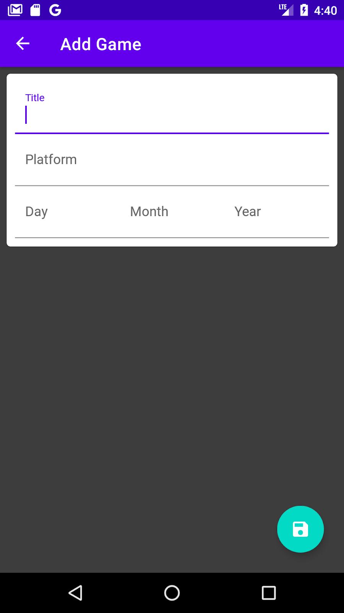
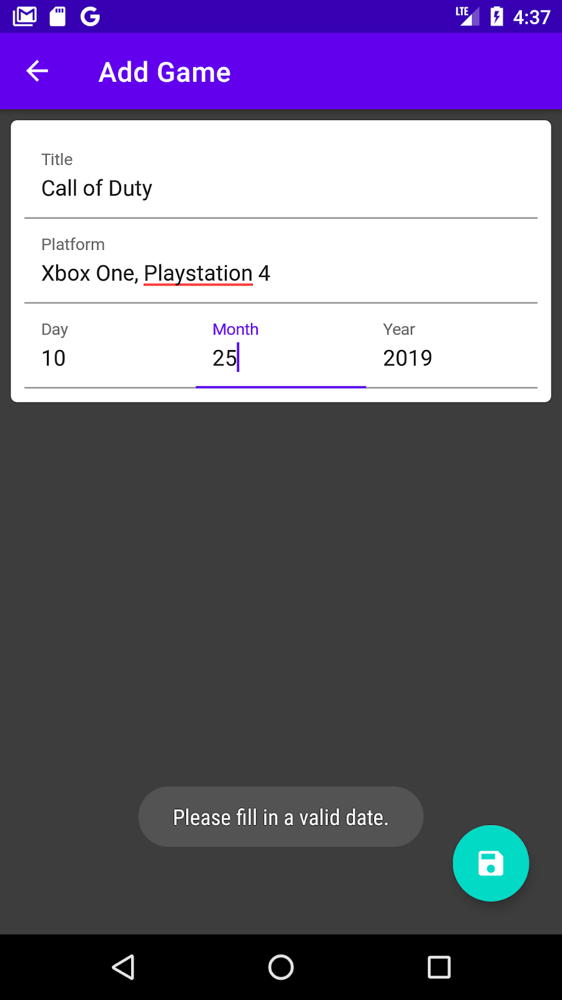
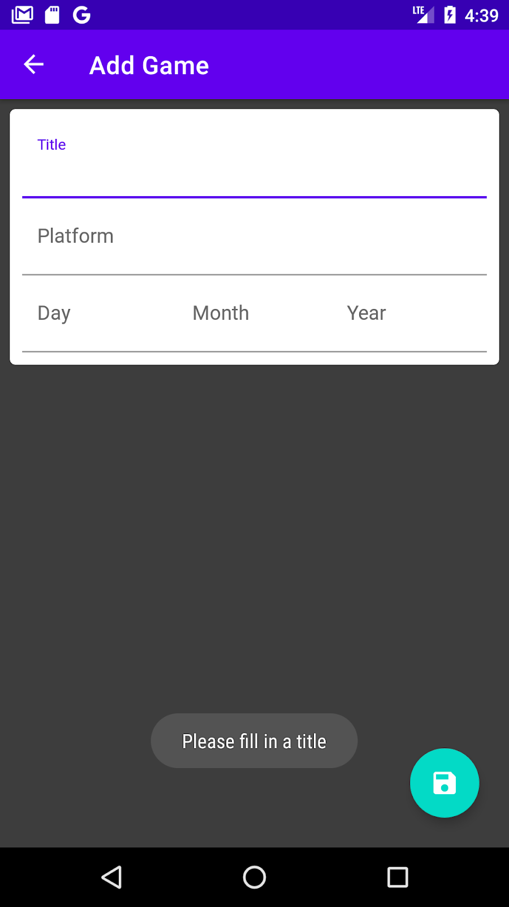
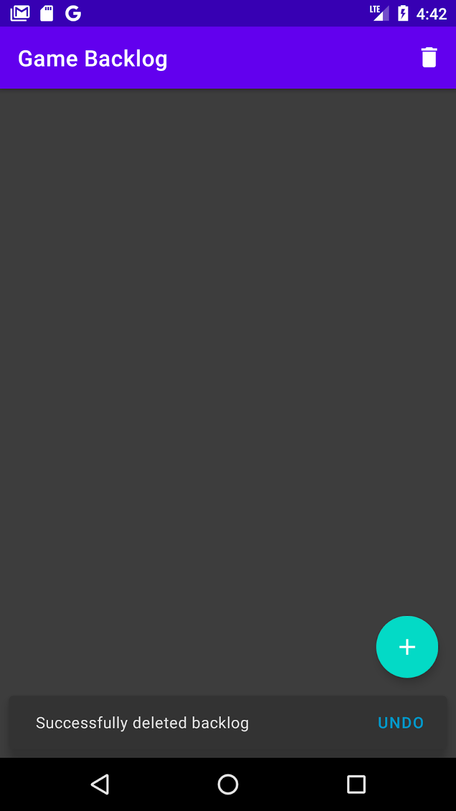
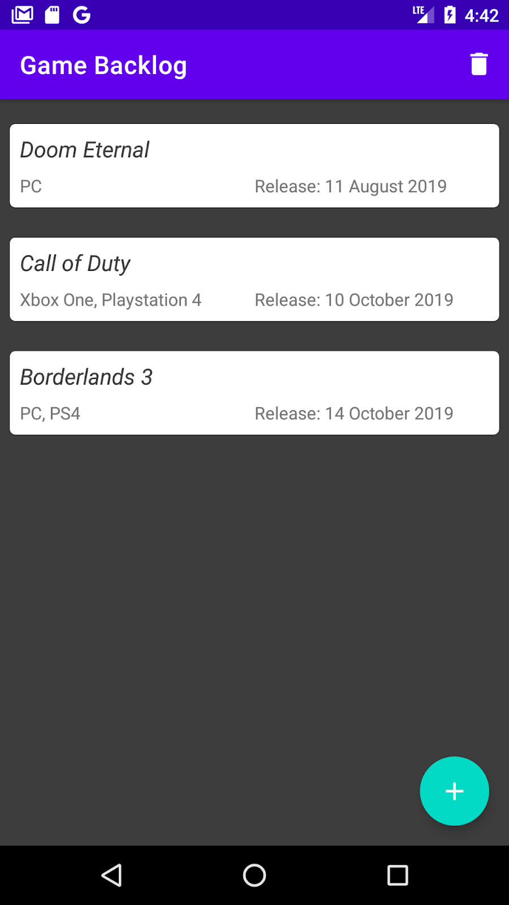
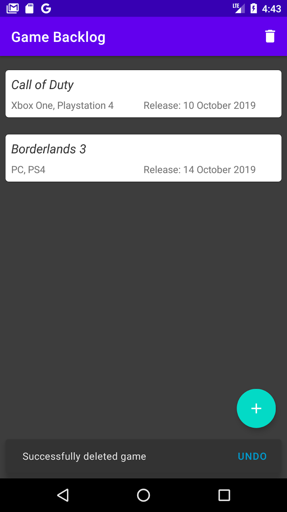

author: HvA
summary: MAD Level 5 - Task 2
id: level5-task2
tags: apps
categories: Apps
status: Published
feedback link: https://github.com/pmeijer-hva/mad-codelabs/issues
analytics account: UA-180951198-1

# MAD Level 5 - Task 2

## Overview

### What we are building

// TODO add gif of finished product maybe because pic are already there :) 

### Requirements
We need to create an application where you can keep track of which new games you want to play.
- The games are locally stored (Room).
- MVVM Architecture is used using the Architecture Components (ViewModel, LiveData).
- A game consists of a title, platform and a release date.
- The games are shown using a [MaterialCardView](https://material.io/develop/android/components/cards) 
  widget (this is included in the material widgets dependency).
- The games are shown in the order of release date (first game to be released is at the top).
- You can add games.
- You can remove games by swiping the game to the left.
- You can remove all games at once by clicking the garbage bin in the toolbar.

The colors are provided:
```xml
<resources>
   <color name="colorPrimary">#009688</color>
   <color name="colorPrimaryDark">#00796B</color>
   <color name="colorAccent">#00695C</color>
   <color name="colorBackgroundDark">#3d3d3d</color>
</resources>
```

The app should look something like this:

 <br>

### Solution

Now, you are on your own. There is no solution provided. Good Luck!
Push the app to your GitHub Repository.

### Optional

The app can be made more user friendly by adding the following improvements:
- Have error handling in the `AddActivity` form and inform the user (fields must not be empty and a valid date must be filled in).
- Display a `snackbar` message in which the user has a few seconds to undo the deletion of the game(s). 
[Guide](https://developer.android.com/training/snackbar/action)
  
The app would then look something like this:

 <br>

 <br>

 <br>
