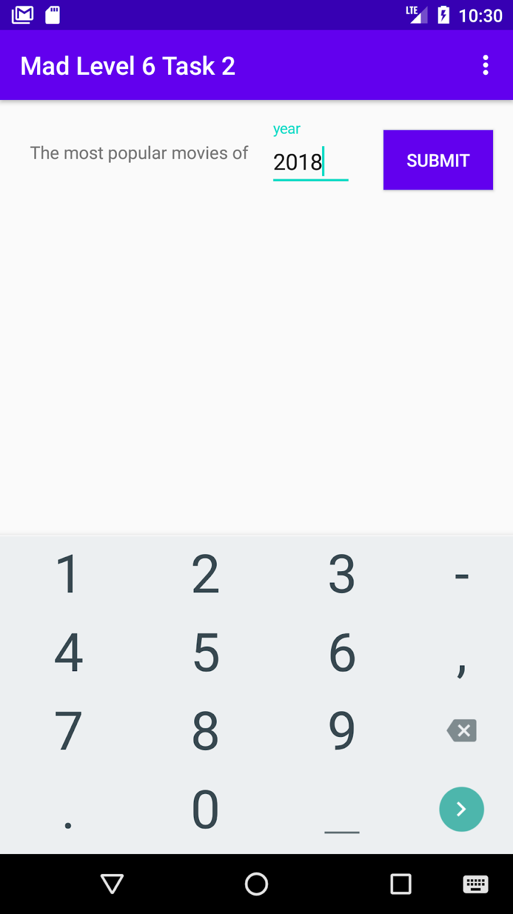
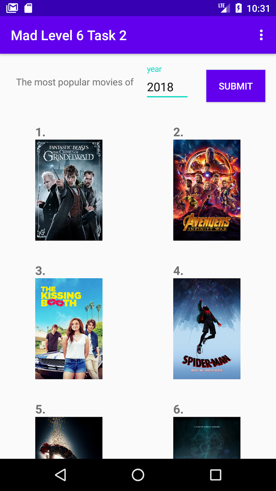
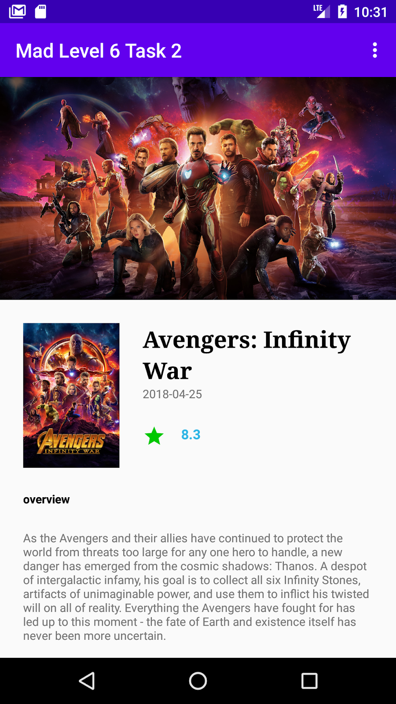

author: HvA
summary: MAD Level 6 - Task 2
id: level6-task2
tags: apps
categories: Apps
status: Published
feedback link: https://github.com/pmeijer-hva/mad-codelabs/issues
analytics account: UA-180951198-1

# MAD Level 6 - Task 2

## Overview

### What we are building

In this assignment, you are going to build an app that displays the most popular movies of a certain year. This list of
movies is retrieved from the api off [The Movie Db](https://developers.themoviedb.org/3/discover/movie-discover).
Clicking a movie will display more information about the movie. The end result should look something like this:

&emsp;&emsp;<br> 

<br>

### Requirements

- A user can input a year.
- After clicking submit, retrieve the most popular (English spoken) movies from The Movie DB and display the movie
  posters in a grid formation with their ranking (using a LinearLayoutManager is also allowed).
- Make use of Retrofit, Glide and Architecture Components (LiveData, ViewModel, Repository).
- Clicking on a movie will open a new screen with additional information about the movie. The information a user should
  see is:
    - Backdrop image;
    - Poster image;
    - Title;
    - Release date;
    - Rating;
    - Overview (plot).
- The transparent toolbar in the movie detail activity can be difficult to accomplish and is optional.

### Solution

Now, you are on your own. There is no solution provided. Good Luck!

### Tips and Resources

- The Movie Db is a large api with many possibilities. We are only going to use the `Discover` feature. You can find the
  documentation [here](https://developers.themoviedb.org/3/discover/movie-discover). On the website there is a tab
  called “try it out” which you can use to construct the api url you need to use.

- To make api calls you need an `Api Key`. Create an account. Go to your account settings. Click on ‘Api’. Request your
  api key, you don’t need to fill in your personal information. Any information will do and you will receive the api key
  instantly.

- If you want to learn how to hide your Api Key from your public github repository refer to the
  following [article](https://guides.codepath.com/android/Storing-Secret-Keys-in-Android)

- To display the images the api returns a relative path to the image. You can find the base url
  [here](https://developers.themoviedb.org/3/getting-started/images)

### Optional

To make the app more user friendly the following requirements can be added:

- Use a ProgressBar widget to display a loading circle when the movies are being fetched.
- Have the cells of each row increase/decrease depending on the screen size (a big phone/tablet would have a larger
  grid).
- Support the change of screen orientation (flipping your phone).
- If you want to calculate the number of cells a row should contain you can use the following code.

```kotlin
private fun initViews() {
    ...

    val gridLayoutManager = GridLayoutManager(requireContext(), 1, RecyclerView.VERTICAL, false)
    binding.rvMovies.layoutManager = gridLayoutManager
    // Add Global Layout Listener to calculate the span count.
    binding.rvMovies.viewTreeObserver.addOnGlobalLayoutListener(object :
            ViewTreeObserver.OnGlobalLayoutListener {
        override fun onGlobalLayout() {
            binding.rvMovies.viewTreeObserver.removeOnGlobalLayoutListener(this)
            gridLayoutManager.spanCount = calculateSpanCount()
            gridLayoutManager.requestLayout()
        }
    })

    ...
}

/**
 * Calculate the number of spans for the recycler view based on the recycler view width.
 * @return int number of spans.
 */
private fun calculateSpanCount(): Int {
    val viewWidth = binding.rvMovies.measuredWidth
    val cardViewWidth = resources.getDimension(R.dimen.poster_width)
    val cardViewMargin = resources.getDimension(R.dimen.margin_medium)
    val spanCount = floor((viewWidth / (cardViewWidth + cardViewMargin)).toDouble()).toInt()
    return if (spanCount >= 1) spanCount else 1
}
```

Positive
: Push the app to your GitLab when it’s finished