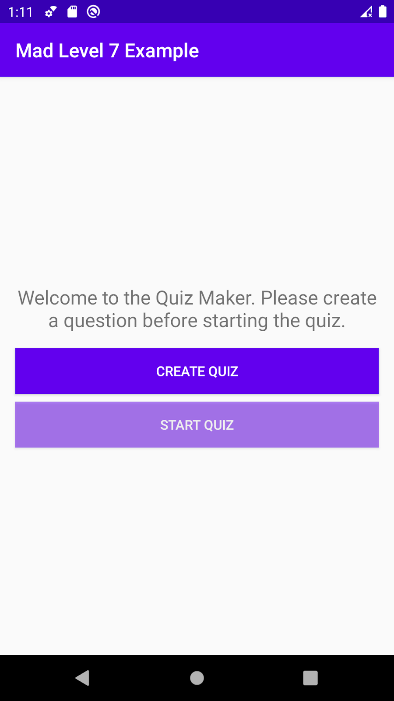
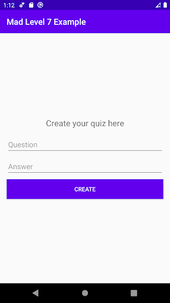
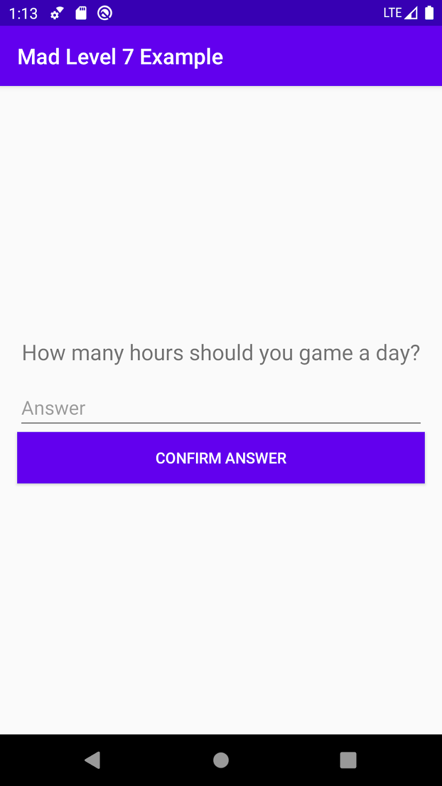

author: HvA
summary: Mad Level 7 Example
id: level7-example
categories: Apps
tags: apps
status: Published
feedback link: https://github.com/pmeijer-hva/mad-codelabs/issues
analytics account: UA-180951198-1

# MAD Level 7 - Example

## Overview

### Requirements

We will be building a quiz app where the user can create a question he wants someone to answer. For simplicity of this
example we will be restricting the app to one question and they won’t be stored in Room. If you want to implement this
yourself you are free to do so. The following new subjects will be covered:

- Firebase & Firestore integrated with our Android architecture components
- Fragments with a shared ViewModel

### Solution

Below you will find the necessary steps to build this app. If you encounter problems you can always check
the [github](https://github.com/Marcellis/quiz-maker-kotlin) where you can find the whole solution. Note that you will
have to add your private google-services.json file before the code will work.

<br>

## Prerequisites

### Basic setup and dependencies

Before we start please do the following by yourself:

- Create the project using the ‘basic activity’ template as you’ve done in previous levels. Rename FirstFragment to
  `HomeFragment` and SecondFragment to `CreateQuizFragment`. Make similar changes to the layout files.
- We’re going to add two dependencies: one for `Firestore` and one to use `coroutines with Firestore`.

`build.gradle (Module: app)`

```
apply plugin: 'com.google.gms.google-services'

...

dependencies {
   ..
   implementation 'com.google.firebase:firebase-firestore-ktx:21.4.3'
   implementation 'org.jetbrains.kotlinx:kotlinx-coroutines-play-services:1.1.1'
}
```

`build.gradle (Project: ..)`

```
dependencies {
       ...
       classpath 'com.google.gms:google-services:4.3.4'
      
       // NOTE: Do not place your application dependencies here; they belong
       // in the individual module build.gradle files
   }
```

Positive
: Do not forget to add view binding

### Setup Firebase’s Firestore

Firebase is a mobile and web application development platform developed by Firebase, Inc. in 2011, then acquired by
Google in 2014. As of March 2020, the Firebase platform has 19 products. One of these is Firestore. Firestore is a
document based database which we can store our quiz data in. To start, go
to [firebase](https://console.firebase.google.com/) and create a new project.

<br>

**When you’re told to fill in a package name, make sure this package name actually corresponds to the app’s package
name:**
**nl.hva.madlevel7example** (or whatever the name of your project is). **The app can’t connect to the Firebase project
if the names don’t match**. After having created your project, click the android logo to add the app to the project and
follow the instructions. A file `google-services.json` should now have been added to your local Android project. It
contains all parameters to link your local project to your project in Firestore. Have a look into this file.

The Cloud Firestore rules should read

```
service cloud.firestore {
  match /databases/{database}/documents {
    match /{document=**} {
      allow read, write: if true;
    }
  }
}
```

## Create the following layouts

 <br> 

- Make sure that the “Start quiz” button is slightly grayed out and not clickable by default. You can achieve this by
  setting the `isClickable` property and the `alpha` property of the button.
- We added a horizontal Guideline layout and let it start at a percentage from the top of the ConstraintLayout, and
  constraint all other visual elements below that. See
  this [link](https://stackoverflow.com/questions/37318228/how-to-make-constraintlayout-work-with-percentage-values).
  The result is as below.

### Add to strings.xml

`strings.xml`

```xml

<string name="tv_welcome">Welcome to the Quiz Maker. Please create a question before stating the quiz.</string>
<string name="bt_create_quiz">Create quiz</string>
<string name="bt_start_quiz">Start quiz</string>
<string name="tv_create_quiz_here">Create your quiz here</string>
<string name="et_question">Question</string>
<string name="et_answer">Answer</string>
<string name="bt_create">Create</string>
        <!-- TODO: Remove or change this placeholder text -->
<string name="hello_blank_fragment">Hello blank fragment</string>

<string name="tv_question_1">How many hours should you game a day?</string>
<string name="et_answer_of_question_1">Answer</string>
<string name="bt_confirm_answer">Confirm answer</string>

<string name="successfully_created_quiz">Quiz was successfully created!</string>
```

### Fragment_home.xml

`Fragment_home.xml`

```xml
<?xml version="1.0" encoding="utf-8"?>
<androidx.constraintlayout.widget.ConstraintLayout
        xmlns:android="http://schemas.android.com/apk/res/android"
        xmlns:app="http://schemas.android.com/apk/res-auto"
        xmlns:tools="http://schemas.android.com/tools"
        android:layout_width="match_parent"
        android:layout_height="match_parent"
        tools:context=".HomeFragment">

    <!--    https://stackoverflow.com/questions/37318228/how-to-make-constraintlayout-work-with-percentage-values-->
    <androidx.constraintlayout.widget.Guideline
            android:id="@+id/guideline"
            android:layout_width="wrap_content"
            android:layout_height="wrap_content"
            android:orientation="horizontal"
            app:layout_constraintGuide_percent="0.3"/>


    <TextView
            android:id="@+id/textView"
            android:layout_width="wrap_content"
            android:layout_height="wrap_content"
            android:gravity="center"
            android:padding="8dp"
            android:text="@string/tv_welcome"
            android:textSize="18sp"
            app:layout_constraintEnd_toEndOf="parent"
            app:layout_constraintStart_toStartOf="parent"
            app:layout_constraintTop_toTopOf="@+id/guideline"/>

    <Button
            android:id="@+id/btCreateQuiz"
            android:layout_width="0dp"
            android:layout_height="wrap_content"
            android:layout_margin="8dp"
            android:backgroundTint="@color/colorPrimary"
            android:text="@string/bt_create_quiz"
            android:textColor="@android:color/white"
            android:textSize="18sp"
            app:layout_constraintEnd_toEndOf="parent"
            app:layout_constraintStart_toStartOf="parent"
            app:layout_constraintTop_toBottomOf="@+id/textView"/>

    <Button
            android:id="@+id/btStartQuiz"
            android:layout_width="0dp"
            android:layout_height="wrap_content"
            android:layout_margin="8dp"
            android:alpha="@dimen/material_emphasis_disabled"
            android:backgroundTint="@color/colorPrimary"
            android:clickable="false"
            android:text="@string/bt_start_quiz"
            android:textColor="@android:color/white"
            android:textSize="18sp"
            app:layout_constraintEnd_toEndOf="parent"
            app:layout_constraintHorizontal_bias="0.0"
            app:layout_constraintStart_toStartOf="parent"
            app:layout_constraintTop_toBottomOf="@+id/btCreateQuiz"/>
</androidx.constraintlayout.widget.ConstraintLayout>
```

### Fragment_create_quiz.xml

`Fragment_create_quiz.xml`

```xml
<?xml version="1.0" encoding="utf-8"?>
<androidx.constraintlayout.widget.ConstraintLayout
        xmlns:android="http://schemas.android.com/apk/res/android"
        xmlns:app="http://schemas.android.com/apk/res-auto"
        xmlns:tools="http://schemas.android.com/tools"
        android:layout_width="match_parent"
        android:layout_height="match_parent"
        android:padding="8dp"
        tools:context=".CreateQuizFragment">

    <androidx.constraintlayout.widget.Guideline
            android:id="@+id/guideline2"
            android:layout_width="wrap_content"
            android:layout_height="wrap_content"
            android:orientation="horizontal"
            app:layout_constraintGuide_percent="0.3"/>

    <TextView
            android:id="@+id/textView2"
            android:layout_width="wrap_content"
            android:layout_height="wrap_content"
            android:gravity="center"
            android:text="@string/tv_create_quiz_here"
            android:textSize="18sp"
            app:layout_constraintEnd_toEndOf="parent"
            app:layout_constraintStart_toStartOf="parent"
            app:layout_constraintTop_toTopOf="@+id/guideline2"/>

    <com.google.android.material.textfield.TextInputLayout
            android:id="@+id/textInputLayout"
            android:layout_width="0dp"
            android:layout_height="wrap_content"
            android:layout_margin="8dp"
            app:layout_constraintEnd_toEndOf="parent"
            app:layout_constraintStart_toStartOf="parent"
            app:layout_constraintTop_toBottomOf="@+id/textView2">

        <com.google.android.material.textfield.TextInputEditText
                android:id="@+id/etCreateQuizQuestion"
                android:layout_width="match_parent"
                android:layout_height="wrap_content"
                android:hint="@string/et_question"/>
    </com.google.android.material.textfield.TextInputLayout>

    <com.google.android.material.textfield.TextInputLayout
            android:id="@+id/textInputLayout2"
            android:layout_width="0dp"
            android:layout_height="wrap_content"
            android:layout_margin="8dp"
            app:layout_constraintEnd_toEndOf="parent"
            app:layout_constraintStart_toStartOf="parent"
            app:layout_constraintTop_toBottomOf="@+id/textInputLayout">

        <com.google.android.material.textfield.TextInputEditText
                android:id="@+id/etCreateQuizAnswer"
                android:layout_width="match_parent"
                android:layout_height="wrap_content"
                android:hint="@string/et_answer"/>
    </com.google.android.material.textfield.TextInputLayout>

    <Button
            android:id="@+id/btCreateQuizConfirmAnswer"
            android:layout_width="0dp"
            android:layout_height="wrap_content"
            android:layout_margin="8dp"
            android:backgroundTint="@color/colorPrimary"
            android:text="@string/bt_create"
            android:textColor="@android:color/white"
            android:textSize="18sp"
            app:layout_constraintEnd_toEndOf="parent"
            app:layout_constraintStart_toStartOf="parent"
            app:layout_constraintTop_toBottomOf="@+id/textInputLayout2"/>
</androidx.constraintlayout.widget.ConstraintLayout>
```

## Create the quiz screen / fragment

### Create a new Destination

Add the quizFragment destination using the **‘new destination’** dropdown.


and select “Create new destination”. Just like in level 6, strip the included factory methods and properties. It should
end up like this:

`QuizFragment.kt`

```kotlin
class QuizFragment : Fragment() {
    private var _binding: FragmentQuizBinding? = null
    private val binding get() = _binding!!

    override fun onCreateView(
            inflater: LayoutInflater, container: ViewGroup?,
            savedInstanceState: Bundle?
    ): View {
        _binding = FragmentQuizBinding.inflate(inflater, container, false)
        return binding.root
    }

    override fun onViewCreated(view: View, savedInstanceState: Bundle?) {
        super.onViewCreated(view, savedInstanceState)
    }

}
```

### The layout of the QuizFragment

Build the layout in `fragment_quiz.xml` so that it looks like the following image:

<br>

The result should be similar to:

`fragment_quiz.xml`

```xml
<?xml version="1.0" encoding="utf-8"?>
<androidx.constraintlayout.widget.ConstraintLayout
        xmlns:android="http://schemas.android.com/apk/res/android"
        xmlns:app="http://schemas.android.com/apk/res-auto"
        xmlns:tools="http://schemas.android.com/tools"
        android:layout_width="match_parent"
        android:layout_height="match_parent"
        android:padding="8dp"
        tools:context=".CreateQuizFragment">

    <androidx.constraintlayout.widget.Guideline
            android:id="@+id/guideline3"
            android:layout_width="wrap_content"
            android:layout_height="wrap_content"
            android:orientation="horizontal"
            app:layout_constraintGuide_percent="0.3"/>

    <TextView
            android:id="@+id/tvQuizQuestion"
            android:layout_width="wrap_content"
            android:layout_height="wrap_content"
            android:gravity="center"
            android:padding="8dp"
            android:text="@string/tv_question_1"
            android:textSize="18sp"
            app:layout_constraintEnd_toEndOf="parent"
            app:layout_constraintStart_toStartOf="parent"
            app:layout_constraintTop_toTopOf="@+id/guideline3"/>

    <com.google.android.material.textfield.TextInputLayout
            android:id="@+id/textInputLayout2"
            android:layout_width="0dp"
            android:layout_height="wrap_content"
            android:layout_margin="8dp"
            app:layout_constraintEnd_toEndOf="parent"
            app:layout_constraintStart_toStartOf="parent"
            app:layout_constraintTop_toBottomOf="@+id/tvQuizQuestion">

        <com.google.android.material.textfield.TextInputEditText
                android:id="@+id/etQuizAnswer"
                android:layout_width="match_parent"
                android:layout_height="wrap_content"
                android:hint="@string/et_answer"/>
    </com.google.android.material.textfield.TextInputLayout>

    <Button
            android:id="@+id/btConfirmAnswer"
            android:layout_width="0dp"
            android:layout_height="wrap_content"
            android:layout_margin="8dp"
            android:backgroundTint="@color/colorPrimary"
            android:text="@string/bt_confirm_answer"
            android:textColor="@android:color/white"
            android:textSize="18sp"
            app:layout_constraintEnd_toEndOf="parent"
            app:layout_constraintStart_toStartOf="parent"
            app:layout_constraintTop_toBottomOf="@+id/textInputLayout2"/>
</androidx.constraintlayout.widget.ConstraintLayout>
```

### nav_graph.xml

Your nav_graph.xml should end up like this:


## Setting up FireStore, the Model, ViewModel and Repository

### Initialize Firestore in the MainActivity

`MainActivity.kt`

```kotlin
class MainActivity : AppCompatActivity() {

    override fun onCreate(savedInstanceState: Bundle?) {
        super.onCreate(savedInstanceState)
        setContentView(R.layout.activity_main)
        setSupportActionBar(toolbar)

        FirebaseFirestore.setLoggingEnabled(true)
        FirebaseApp.initializeApp(this)
    }

}
```

### Create the Quiz model

`Quiz.kt`

```kotlin
data class Quiz(
        val question: String,
        val answer: String
)
```

### Create the Repository

`QuizRepository.kt`

```kotlin
class QuizRepository {
    private var firestore: FirebaseFirestore = FirebaseFirestore.getInstance()
    private var quizDocument =
            firestore.collection("quizzes").document("quiz")

    private val _quiz: MutableLiveData<Quiz> = MutableLiveData()

    val quiz: LiveData<Quiz>
        get() = _quiz

    //the CreateQuizFragment can use this to see if creation succeeded
    private val _createSuccess: MutableLiveData<Boolean> = MutableLiveData()

    val createSuccess: LiveData<Boolean>
        get() = _createSuccess

    suspend fun getQuiz() {
        try {
            //firestore has support for coroutines via the extra dependency we've added :)
            withTimeout(5_000) {
                val data = quizDocument
                        .get()
                        .await()

                val question = data.getString("question").toString()
                val answer = data.getString("answer").toString()

                _quiz.value = Quiz(question, answer)
            }
        } catch (e: Exception) {
            throw QuizRetrievalError("Retrieval-firebase-task was unsuccessful")
        }
    }

    suspend fun createQuiz(quiz: Quiz) {
        // persist data to firestore
        try {
            //firestore has support for coroutines via the extra dependency we've added :)
            withTimeout(5_000) {
                quizDocument
                        .set(quiz)
                        .await()

                _createSuccess.value = true
            }

        } catch (e: Exception) {
            throw QuizSaveError(e.message.toString(), e)
        }
    }

    class QuizSaveError(message: String, cause: Throwable) : Exception(message, cause)
    class QuizRetrievalError(message: String) : Exception(message)
}
```

Create the `QuizRepository` class.

1. At the top you see two properties, `firestore` and `quizDocument`. The first one makes sure we have an instance of
   Firestore the second one is a reference to the document that we need to store/retrieve our quiz.
2. Then we see two pieces of LiveData. The `quiz` property should be self-explanatory by now. The `createSucess` is to
   let views know if the creation in the database has succeeded(this could be false when no internet connection is
   available for example). The ViewModel will later on determine what error to show based on this boolean.
3. In a similar fashion of how we interact with Retrofit in level 6 we now have two methods that use coroutines to
   interact with Firestore. If succeeded the `quiz` LiveData property will be set, if not an Exception will be thrown.
   These exceptions are our own exceptions defined by us at the bottom of the class.

### Create the ViewModel

```kotlin
class QuizViewModel(application: Application) : AndroidViewModel(application) {
    private val TAG = "FIRESTORE"
    private val quizRepository: QuizRepository = QuizRepository()

    val quiz: LiveData<Quiz> = quizRepository.quiz

    val createSuccess: LiveData<Boolean> = quizRepository.createSuccess

    private val _errorText: MutableLiveData<String> = MutableLiveData()
    val errorText: LiveData<String>
        get() = _errorText

    fun getQuiz() {
        viewModelScope.launch {
            try {
                quizRepository.getQuiz()
            } catch (ex: QuizRepository.QuizRetrievalError) {
                val errorMsg = "Something went wrong while retrieving quiz.\n" +
                        "It could be that you still need to install your own google-services.json file from Firestore."
                Log.e(TAG, ex.message ?: errorMsg)
                _errorText.value = errorMsg
            }
        }
    }

    fun createQuiz(question: String, answer: String) {
        // persist data to firestore
        val quiz = Quiz(question, answer)
        viewModelScope.launch {
            try {
                quizRepository.createQuiz(quiz)
            } catch (ex: QuizRepository.QuizSaveError) {
                val errorMsg = "Something went wrong while saving quiz.\n" +
                        "It could be that you still need to install your own google-services.json file from Firestore."
                Log.e(TAG, ex.message ?: errorMsg)
                _errorText.value = errorMsg
            }
        }
    }

    fun isAnswerCorrect(answer: String): Boolean {
        return quiz.value?.answer?.toLowerCase(Locale.ROOT) == answer.toLowerCase(Locale.ROOT)
    }

}
```

Create the `QuizViewModel` class.

The ViewModel won’t be responsible for talking to Firebase. This is the responsibility of the Repository we have
created. In here we do the following things:

- Setup three types of LiveData we can later use to retrieve the data AND also retrieve the status of a request.
- We have a method `createQuiz()` and a methode `getQuiz()`. They both use the by now familiar `viewModelScope` to
  interact with the repository. If there might be an exception thrown by the Repository we will emit that to the view
  via LiveData.
- Lastly, we have a method we can later on use to validate if a right answer has been given to a quiz question.

## View logic

### The HomeFragment

`HomeFragment.kt`

```kotlin
class HomeFragment : Fragment() {

    private var _binding: FragmentHomeBinding? = null
    private val binding get() = _binding!!

    private val viewModel: QuizViewModel by activityViewModels()

    override fun onCreateView(
            inflater: LayoutInflater, container: ViewGroup?,
            savedInstanceState: Bundle?
    ): View {
        _binding = FragmentHomeBinding.inflate(inflater, container, false)
        return binding.root
    }

    override fun onViewCreated(view: View, savedInstanceState: Bundle?) {
        super.onViewCreated(view, savedInstanceState)

        val navController = findNavController()

        //always retrieve quiz  when screen is shown
        viewModel.getQuiz()

        binding.btCreateQuiz.setOnClickListener {
            navController.navigate(R.id.action_homeFragment_to_createQuizFragment)
        }

        viewModel.quiz.observe(viewLifecycleOwner, {
            //make button visible and clickable
            if (!it.answer.isBlank() || !it.answer.isBlank()) {
                binding.btStartQuiz.alpha = 1.0f
                binding.btStartQuiz.isClickable = true

                binding.btStartQuiz.setOnClickListener {
                    navController.navigate(R.id.action_homeFragment_to_quizFragment)
                }
            }
        })

    }
}
```

First we obtain an instance of the just created ViewModel.

Then in our `onViewCreated(..)` we kick off the retrieval of the Quiz object by calling `viewModel.getQuiz()`. When it
is successfully retrieved our observer will trigger. The code in here will make the “Start Quiz” button fully visible
and clickable. This way a user can only click this button if there is an actual Quiz object present.

If a user has never made a quiz before he/she can click the Create Quiz button and will be taken to the
`CreateQuizFragment`.

### The CreateQuizFragment

`CreateQuizFragment.kt`

```kotlin
class CreateQuizFragment : Fragment() {

    private var _binding: FragmentCreateQuizBinding? = null
    private val binding get() = _binding!!

    private val viewModel: QuizViewModel by viewModels()

    override fun onCreateView(
            inflater: LayoutInflater, container: ViewGroup?,
            savedInstanceState: Bundle?
    ): View {
        _binding = FragmentCreateQuizBinding.inflate(inflater, container, false)
        return binding.root
    }

    override fun onViewCreated(view: View, savedInstanceState: Bundle?) {
        super.onViewCreated(view, savedInstanceState)

        binding.btCreateQuizConfirmAnswer.setOnClickListener {
            viewModel.createQuiz(
                    binding.etCreateQuizQuestion.text.toString(),
                    binding.etCreateQuizAnswer.text.toString()
            )
        }

        observeQuizCreation()
    }

    private fun observeQuizCreation() {
        viewModel.createSuccess.observe(viewLifecycleOwner, {
            Toast.makeText(activity, R.string.successfully_created_quiz, Toast.LENGTH_LONG).show()
            findNavController().popBackStack()
        })

        viewModel.errorText.observe(viewLifecycleOwner, {
            Toast.makeText(activity, it, Toast.LENGTH_SHORT).show()
        })
    }

}
```

Again we start by obtaining an instance of the viewmodel. Here we don’t use by `activityViewModels()` but the regular
helper. Otherwise we get trouble after creating a quiz. For somehow the livedata keeps triggering when leaving and
re-entering this screen. Therefore only the `HomeFragment` and the `QuizFragment` will use `activityViewModels()`.

Then we have the `observeQuizCreation` method. This method observes whether storing the `Quiz` object in `Firestore` has
succeeded or not with the corresponding actions.

### The QuizFragment

`QuizFragment.kt`

```kotlin
class QuizFragment : Fragment() {

    private var _binding: FragmentQuizBinding? = null
    private val binding get() = _binding!!

    private val viewModel: QuizViewModel by activityViewModels()

    override fun onCreateView(
            inflater: LayoutInflater, container: ViewGroup?,
            savedInstanceState: Bundle?
    ): View {
        _binding = FragmentQuizBinding.inflate(inflater, container, false)
        return binding.root
    }

    override fun onViewCreated(view: View, savedInstanceState: Bundle?) {
        super.onViewCreated(view, savedInstanceState)

        observeQuiz()
    }

    private fun observeQuiz() {
        viewModel.quiz.observe(viewLifecycleOwner, {
            val quiz = it
            binding.tvQuizQuestion.text = quiz.question

            binding.btConfirmAnswer.setOnClickListener {
                if (viewModel.isAnswerCorrect(binding.etQuizAnswer.text.toString())) {
                    Toast.makeText(context, "Your answer is correct!", Toast.LENGTH_LONG).show()
                    findNavController().popBackStack()
                } else {
                    Toast.makeText(
                            context,
                            "Your answer is incorrect! The correct answer was: ${quiz.answer}",
                            Toast.LENGTH_LONG
                    ).show()
                }
            }
        })
    }
}
```

Again we start by obtaining an instance of the viewmodel. Here we use the by `activityViewModels()` again.

Then in `observeQuiz()`, as soon as we have the Quiz object available(which should be there from the previous screen),
we set the `question` of the Quiz object on the Textview and we add a click listener. If the answer is correct we send
the user back to the `HomeFragment`, otherwise we show a Toast message!

Positive
: Test the app, try to see if it also works with internet switched on and off! If everything is working push to your
github repository 


