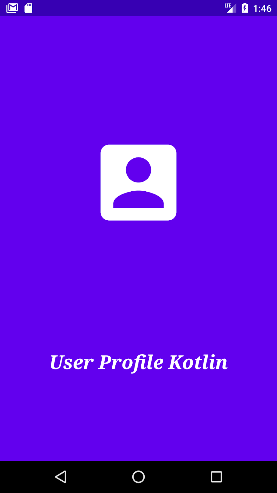
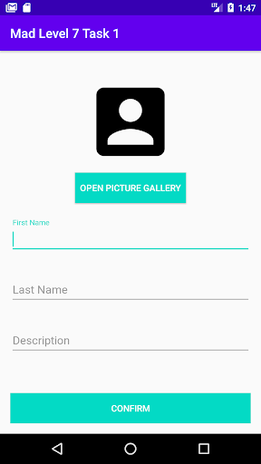
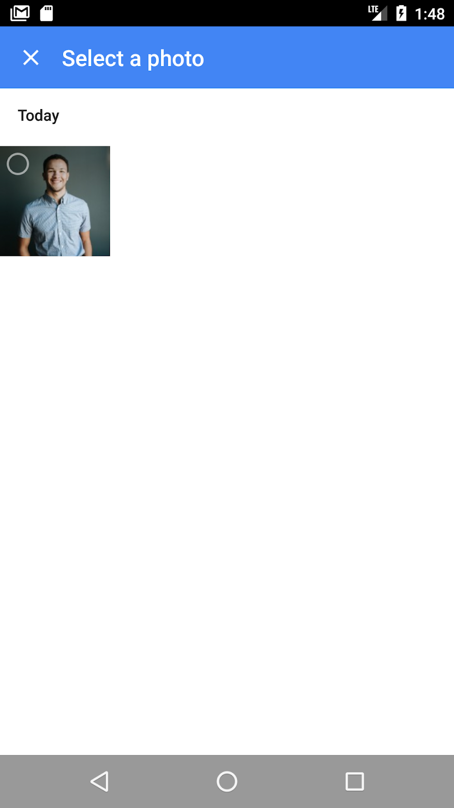
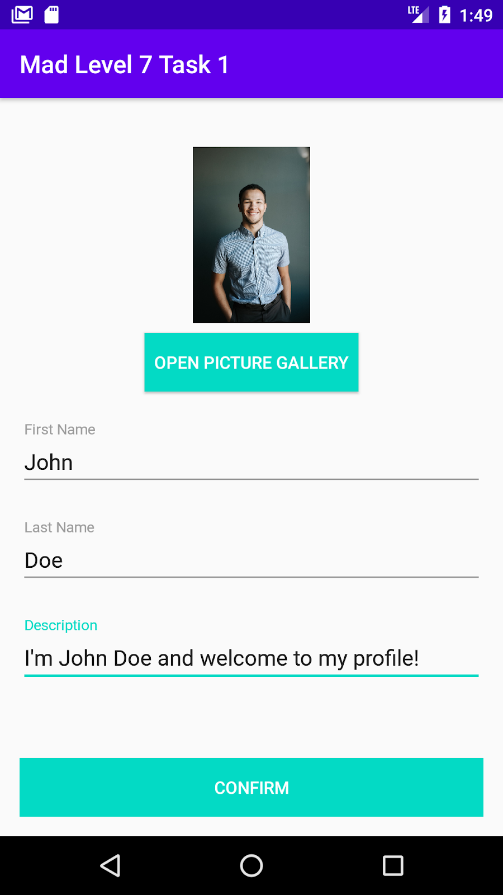
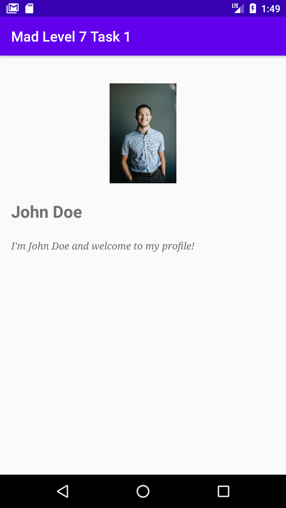
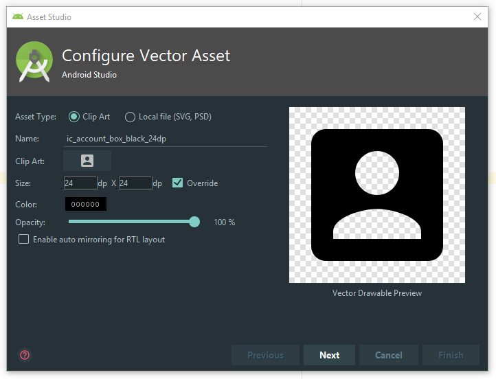

author: HvA
summary: MAD Level 7 - Task 1
id: level7-task1
tags: apps
categories: Apps
status: Published
feedback link: https://github.com/pmeijer-hva/mad-codelabs/issues
analytics account: UA-180951198-1

# MAD Level 7 - Task 1

## Overview

### Requirements

Build a user profile app in which the user can create a profile with his/her name, a description and a profile picture
which can be selected from the image gallery on the user’s phone. The app will also have a splash screen.


&emsp;&emsp;<br>


&emsp;&emsp;<br>

<br>

### Solution

Below you can find the necessary steps to build this app. If you encounter problems you can always check
the [github](https://github.com/Marcellis/user-profile-kotlin) where you can find the whole solution.

## Prerequisites

Before we start please do the following by yourself:

- Create the project using the ‘empty activity’ template as you’ve done in previous levels.
- Create a new project on the `Firebase console` like described in the example.
- We’re going to add two dependencies: one for `Firestore` and one to use `coroutines with Firestore`.

`build.gradle (Module: app)`

```
apply plugin: 'com.google.gms.google-services'

...

dependencies {
   ..
   implementation 'com.google.firebase:firebase-firestore-ktx:22.0.1'
   implementation 'org.jetbrains.kotlinx:kotlinx-coroutines-play-services:1.1.1'
}
```

`build.gradle (Project: ..)`

```
dependencies {
       ...
       classpath 'com.google.gms:google-services:4.3.4'
      
       // NOTE: Do not place your application dependencies here; they belong
       // in the individual module build.gradle files
   }
```

Positive
: Do not forget to add view binding

## Splash Screen

The first step of creating the app will be making a `splash screen`.

### Add a new style

- Rename the MainActivity and name it `SplashActivity`. Rename the layout file accordingly.
- Create a new style in `styles.xml` and call it `SplashScreenTheme`
    - Give it the parent `Theme.AppCompat.Light.NoActionBar`
    - Give it an item which sets the statusBarColor to `colorPrimaryDark`
- Add the style to the `SplashActivity`.

`styles.xml`

```xml
<!--Style for Splash Screen-->
<style name="SplashScreenTheme" parent="Theme.AppCompat.Light.NoActionBar">
    <item name="android:statusBarColor">@color/colorPrimaryDark</item>
    <item name="android:background">@color/colorPrimaryDark</item>
</style>
```

`AndroidManifest.xml`

```xml

<activity
        android:name=".SplashActivity"
        android:theme="@style/SplashScreenTheme">
    <intent-filter>
        <action android:name="android.intent.action.MAIN"/>

        <category android:name="android.intent.category.LAUNCHER"/>
    </intent-filter>
</activity>
```

We don’t want an `ActionBar` in the `SplashScreen`. That’s why a new style was created which has the
parent `NoActionBar` and is set only to the `SplashActivity`.

### Build the SplashActivity layout

Go to the `activity_splash` layout file and use an ImageView and a TextView to create the layout for this activity. The
layout should look like the Splash Screen image from the requirements section of this document. The picture used has
been created using the Asset Studio within Android Studio. Go to drawable folder -> right click -> new -> Vector Asset.
Create two vectors, one with the color white and one with the color black.



### Build the SplashActivity functionality

A `SplashScreen` will be displayed for a few seconds after which it opens a new Activity.

Use a Handler to start a `CreateProfileActivity` (we will make this in the next step) after 1 second.

`SplashActivity.kt`

```kotlin
class SplashActivity : AppCompatActivity() {
    override fun onCreate(savedInstanceState: Bundle?) {
        super.onCreate(savedInstanceState)
        setContentView(R.layout.activity_splash)

        // Use Handler to wait 1 second before opening the MainActivity.
        Handler(Looper.getMainLooper()).postDelayed({
            startActivity(
                    Intent(
                            this@SplashActivity,
                            MainActivity::class.java
                    )
            )
            finish()
        }, 1000)

    }
}
```

Because we are making a Splash Screen the activity should automatically go to the next activity after 1 second.

To run an action with a delay we make use of a `Handler`. At the end of the `onCreate` from the `SplashActivity` use the
postDelayed method of a new Handler object to start the, to be created in the next step, `MainActivity` using an intent.

The `SplashActivity` must also be finished so that it is removed from the back stack (so that when a user presses the
back button the splash screen doesn’t re-open).

### MainActivity

Renaming the `MainActivity` in the previous step was done so you don’t have to specify the `SplashActivity` as the
activity that launches the app in the `AndroidManifest.xml` file. We still need a `MainActivity` class however. Create a
new `basic activity` and name it `MainActivity`. Rename FirstFragment into `CreateProfileFragment`; SecondFragment
into `ProfileFragment`; and the xml layout files accordingly. And adapt `nav_graph.xml` accordingly.

`MainActivity.kt`

```kotlin
class MainActivity : AppCompatActivity() {

    override fun onCreate(savedInstanceState: Bundle?) {
        super.onCreate(savedInstanceState)
        setContentView(R.layout.activity_main)
        setSupportActionBar(findViewById(R.id.toolbar))

        findViewById<FloatingActionButton>(R.id.fab).setOnClickListener { view ->

            FirebaseFirestore.setLoggingEnabled(true)
            FirebaseApp.initializeApp(this)
            findNavController(R.id.nav_host_fragment).navigate(R.id.createProfileFragment)
        }
    }
}
```

The important part here is to make sure to set up `Firebase`.

Also make sure you have the following layout files `activity_main.xml` and `content_main.xml` like you have done in
previous assignments, where the `content_main.xml` contains the navigation host fragment element.

### Strings.xml

Just to save some time, `strings.xml` should contain next to your own defined strings:

`strings.xml`

```xml

<string name="app_name">Mad Level 7 Task 1</string>

<string name="splash_text">User Profile Kotlin</string>
<string name="title_activity_main">MainActivity</string>
        <!--
        This string is used for square devices and overridden by hello_world in
        values-round/strings.xml for round devices.
        -->
<string name="hello_world">Hello Square World!</string>
        <!-- Strings used for fragments for navigation -->
<string name="first_fragment_label">First Fragment</string>
<string name="second_fragment_label">Second Fragment</string>
<string name="next">Next</string>
<string name="previous">Previous</string>

<string name="hello_first_fragment">Hello first fragment</string>
<string name="hello_second_fragment">Hello second fragment. Arg: %1$s</string>

<string name="first_name">First Name</string>
<string name="last_name">Last Name</string>
<string name="description">Description</string>

<string name="action_settings">Settings</string>
<string name="create_profile_fragment_label">Create Profile</string>
<string name="profile_fragment_label">Profile</string>
<string name="successfully_created_profile">profile created</string>
<string name="profile_name">%1$s %2$s</string>
<string name="open_picture_gallery">Open Picture Gallery</string>
<string name="confirm">Confirm</string>
<string name="user_profile_kotlin">User Profile Kotlin</string>
<string name="description_hint">Description</string>
<string name="tv_description">My description</string>
<string name="tv_name">John Doe</string>
<string name="iv_profile_image_content_description">Avatar</string>
<string name="iv_splash_image_content_description">Splash Screen Logo</string>
<string name="first_name_hint">First Name</string>
<string name="last_name_hint">Last Name</string>
```

## Create the Repository

`ProfileRepository.kt`

```kotlin
class ProfileRepository {
    private var firestore: FirebaseFirestore = FirebaseFirestore.getInstance()
    private var profileDocument =
            firestore.collection("profiles").document("profile")

    private val _profile: MutableLiveData<Profile> = MutableLiveData()

    val profile: LiveData<Profile>
        get() = _profile

    // The CreateProfileFragment can use this to see if creation succeeded
    private val _createSuccess: MutableLiveData<Boolean> = MutableLiveData()

    val createSuccess: LiveData<Boolean>
        get() = _createSuccess

    suspend fun getProfile() {
        try {
            withTimeout(5_000) {
                val data = profileDocument
                        .get()
                        .await()

                val firstName = data.getString("firstName").toString()
                val lastName = data.getString("lastName").toString()
                val description = data.getString("description").toString()
                val imageUri = data.getString("imageUri").toString()

                _profile.value = Profile(firstName, lastName, description, imageUri)
            }
        } catch (e: Exception) {
            throw ProfileRetrievalError("Retrieval-firebase-task was unsuccessful")
        }
    }

    suspend fun createProfile(profile: Profile) {
        // Persist data to Firestore
        try {
            withTimeout(5_000) {
                profileDocument
                        .set(profile)
                        .await()

                _createSuccess.value = true
            }

        } catch (e: Exception) {
            throw ProfileSaveError(e.message.toString(), e)
        }
    }

    class ProfileSaveError(message: String, cause: Throwable) : Exception(message, cause)
    class ProfileRetrievalError(message: String) : Exception(message)
}
```

Create the `ProfileRepository` class.

At the top you see two properties, `firestore` and `profileDocument`. The first one makes sure we have an instance of
`Firestore` the second one is a reference to the document that we need to store/retrieve our quiz. Then we see two
pieces of `LiveData`. The profile property should be self-explanatory by now. The createSucess is to let views know if
the creation in the database has succeeded(this could be false when no internet connection is available for example).
The
`ViewModel` will later on determine what error to show based on this boolean. In a similar fashion of how we interact
with Retrofit in level 6 we now have two methods that use coroutines to interact with Firestore. If succeeded, the
profile LiveData property will be set, if not an Exception will be thrown. These exceptions are our **own** exceptions
defined by us at the bottom of the class.

## Create the ViewModel

`ProfileViewModel.kt`

```kotlin
class ProfileViewModel(application: Application) : AndroidViewModel(application) {
    private val TAG = "FIRESTORE"
    private val profileRepository: ProfileRepository = ProfileRepository()

    val profile: LiveData<Profile> = profileRepository.profile

    val createSuccess: LiveData<Boolean> = profileRepository.createSuccess

    private val _errorText: MutableLiveData<String> = MutableLiveData()
    val errorText: LiveData<String>
        get() = _errorText

    fun getProfile() {
        viewModelScope.launch {
            try {
                profileRepository.getProfile()
            } catch (ex: ProfileRepository.ProfileRetrievalError) {
                val errorMsg = "Something went wrong while retrieving profile"
                Log.e(TAG, ex.message ?: errorMsg)
                _errorText.value = errorMsg
            }
        }
    }

    fun createProfile(firstName: String, lastName: String, description: String, imageUri: String) {
        // persist data to firestore
        val profile = Profile(firstName, lastName, description, imageUri)

        viewModelScope.launch {
            try {
                profileRepository.createProfile(profile)
            } catch (ex: ProfileRepository.ProfileSaveError) {
                val errorMsg = "Something went wrong while saving quiz"
                Log.e(TAG, ex.message ?: errorMsg)
                _errorText.value = errorMsg
            }
        }
    }
}
```

Create the `ProfileViewModel` class.

The `ViewModel` won’t be responsible for talking to `Firebase`. This is the responsibility of the `Repository` we have
created. In here we do the following things:

Setup three types of `LiveData` we can later use to retrieve the data **AND** also retrieve the status of a request. We
have a method `createProfile()` and a methode `getProfile()`. They both use the, by now familiar, `viewModelScope` to
interact with the repository. If there might be an exception thrown by the Repository we will emit that to the view via
LiveData. Lastly, we have a method we can later on use to validate if a right answer has been given to a quiz question.

## CreateProfileFragment

In this step we are going to build the `Fragment` used for creating a profile.

### Build the fragment and the layout

In the previous step the splash screen will start the MainActivity. The first fragment that will be shown is the
`CreateProfileFragment` so we will need to build it.

The layout looks similar to the following.

`fragment_create_profile.xml`

```xml
<?xml version="1.0" encoding="utf-8"?>
<androidx.constraintlayout.widget.ConstraintLayout
        xmlns:android="http://schemas.android.com/apk/res/android"
        xmlns:app="http://schemas.android.com/apk/res-auto"
        xmlns:tools="http://schemas.android.com/tools"
        android:layout_width="match_parent"
        android:layout_height="match_parent"
        android:padding="12dp"
        tools:context=".MainActivity">

    <ImageView
            android:id="@+id/ivProfileImage"
            android:layout_width="144dp"
            android:layout_height="144dp"
            android:layout_marginTop="24dp"
            android:contentDescription="@string/profile_image"
            android:src="@drawable/ic_account_box_black"
            app:layout_constraintEnd_toEndOf="parent"
            app:layout_constraintStart_toStartOf="parent"
            app:layout_constraintTop_toTopOf="parent"/>

    <Button
            android:id="@+id/btnGallery"
            android:layout_width="wrap_content"
            android:layout_height="wrap_content"
            android:layout_marginTop="12dp"
            android:background="@color/colorAccent"
            android:padding="12dp"
            android:text="@string/open_picture_gallery"
            android:textColor="@android:color/white"
            app:layout_constraintEnd_toEndOf="parent"
            app:layout_constraintStart_toStartOf="parent"
            app:layout_constraintTop_toBottomOf="@id/ivProfileImage"/>


    <com.google.android.material.textfield.TextInputLayout
            android:id="@+id/tilFirstName"
            android:layout_width="0dp"
            android:layout_height="wrap_content"
            android:layout_marginTop="12dp"
            app:layout_constraintEnd_toEndOf="parent"
            app:layout_constraintStart_toStartOf="parent"
            app:layout_constraintTop_toBottomOf="@id/btnGallery">

        <com.google.android.material.textfield.TextInputEditText
                android:id="@+id/etFirstName"
                android:layout_width="match_parent"
                android:layout_height="wrap_content"
                android:hint="@string/first_name"
                android:inputType="text"
                android:maxLines="1"/>

    </com.google.android.material.textfield.TextInputLayout>

    <com.google.android.material.textfield.TextInputLayout
            android:id="@+id/tilLastName"
            android:layout_width="0dp"
            android:layout_height="wrap_content"
            android:layout_marginTop="12dp"
            app:layout_constraintEnd_toEndOf="parent"
            app:layout_constraintStart_toStartOf="parent"
            app:layout_constraintTop_toBottomOf="@id/tilFirstName">

        <com.google.android.material.textfield.TextInputEditText
                android:id="@+id/etLastName"
                android:layout_width="match_parent"
                android:layout_height="wrap_content"
                android:hint="@string/last_name"
                android:inputType="text"
                android:maxLines="1"/>

    </com.google.android.material.textfield.TextInputLayout>

    <com.google.android.material.textfield.TextInputLayout
            android:id="@+id/tilProfileDescription"
            android:layout_width="0dp"
            android:layout_height="wrap_content"
            android:layout_marginTop="12dp"
            app:layout_constraintBottom_toTopOf="@id/btnConfirm"
            app:layout_constraintEnd_toEndOf="parent"
            app:layout_constraintStart_toStartOf="parent"
            app:layout_constraintTop_toBottomOf="@id/tilLastName"
            app:layout_constraintVertical_bias="0">

        <com.google.android.material.textfield.TextInputEditText
                android:id="@+id/etProfileDescription"
                android:layout_width="match_parent"
                android:layout_height="wrap_content"
                android:hint="@string/description"
                android:inputType="textMultiLine"/>

    </com.google.android.material.textfield.TextInputLayout>

    <Button
            android:id="@+id/btnConfirm"
            android:layout_width="0dp"
            android:layout_height="wrap_content"
            android:background="@color/colorAccent"
            android:text="@string/confirm"
            android:textColor="@android:color/white"
            app:layout_constraintBottom_toBottomOf="parent"
            app:layout_constraintEnd_toEndOf="parent"
            app:layout_constraintStart_toStartOf="parent"/>

</androidx.constraintlayout.widget.ConstraintLayout>
```

### Open the picture gallery

To open the picture gallery from the user’s phone an Intent is used.

- Create a method called `onGalleryClick` and call it when the gallery button is clicked.
- Create an intent with the parameter `Intent.ACTION_PICK`
- Set the type of the intent to “image/*”
- Use `startActivityForResult` with the `galleryIntent` and a **unique** request code.

`CreateProfileFragment.kt`

```kotlin
class CreateProfileFragment : Fragment() {

    private var _binding: FragmentCreateProfileBinding? = null
    private val binding get() = _binding!!

    override fun onCreateView(
            inflater: LayoutInflater, container: ViewGroup?,
            savedInstanceState: Bundle?
    ): View {
        _binding = FragmentCreateProfileBinding.inflate(inflater, container, false)
        return binding.root
    }

    override fun onViewCreated(view: View, savedInstanceState: Bundle?) {
        super.onViewCreated(view, savedInstanceState)

        binding.btnGallery.setOnClickListener { onGalleryClick() }
        binding.btnConfirm.setOnClickListener { onConfirmClick() }
    }

    private fun onGalleryClick() {
        // Create an Intent with action as ACTION_PICK
        val galleryIntent = Intent(Intent.ACTION_PICK)

        // Sets the type as image/*. This ensures only components of type image are selected
        galleryIntent.type = "image/*"

        // Start the activity using the gallery intent
        startActivityForResult(galleryIntent, GALLERY_REQUEST_CODE)
    }

    companion object {
        const val GALLERY_REQUEST_CODE = 100
    }
}
```

An Intent object is created using `ACTION_PICK`. The Intent class contains static final strings with actions you can use
that are already provided by the `Android Framework` such as opening the camera or in our case opening the picture
gallery. We want the user to be able to pick an image from his or her photo gallery which means we will be needing the
`ACTION_PICK` action. We also need to set a `type` to the intent because we only want images and not for example videos.

After this `startActivityForResult` can be used to let Android know that it can start the activity defined by the
Intent. Create a method called `onGalleryClick` which is responsible for all of this. Make sure you have created the
onClickListener for this function.

If you test the app you will notice that the gallery opens and you can select an image but then when the app returns to
the `CreateProfileActivity` nothing has happened. This is because we haven’t implemented the handling of the selected
image yet.

### Handling image selected

To implement the handling of the selected image do the following:

- Override the `onActivityResult` method.
- Check if the result code equals `Activity.RESULT_OK` and check if the requestCode equals `GALLERY_REQUEST_CODE`.
- If the result and request code matches then you can get the uri from the selected image using data?.data.
- Create a class variable called `profileImageUri` and set it to the value from `data?.data`. Also set the `imageView`
  to the
  `profileImageUri`.

`CreateProfileFragment.kt`

```kotlin
private var profileImageUri: Uri? = null

...

override fun onActivityResult(requestCode: Int, resultCode: Int, data: Intent?) {
    if (resultCode == Activity.RESULT_OK) {
        when (requestCode) {
            GALLERY_REQUEST_CODE -> {
                profileImageUri = data?.data
                binding.ivProfileImage.setImageURI(profileImageUri)
            }
        }
    }
}
```

The `onActivityResult` method will be invoked when the user has selected an image. When we started the activity we sent
in the request code `GALLERY_REQUEST_CODE` so when we find this request code we know that the activity resumes after
this action.

A class variable var `profileImageUri` is created to keep track of the latest image selected. The `ImageView` is set
using this uri.

### Create a Profile data class

Create a data class named Profile which has a first name, last name, description and an imageUri.

`Profile.kt`

```kotlin
data class Profile(
        val firstName: String,
        val lastName: String,
        val description: String,
        val imageUri: String?
)
```

A question mark is added after Uri which indicates that this variable is nullable (i.e. we don’t require a user to have
a profile image).

### Starting the ProfileFragment

- In the `CreateProfileFragment` class, create a method called `onConfirmClick` and make sure that the `onClickListener`
  of the confirm Button calls this.
    - Create a new `Profile` object using the `TextInputEditText` widgets and the `profileImageUri` class variable.
    - Get the `reference` to the navigation controller for navigating to the `ProfileFragment` (will be created in the
      next step).
    - Set up a `reference` to the `ProfileViewModel` (which we will create later).
    - Create the `profile` via the `ViewModel` and navigate to the `ProfileFragment`.

`CreateProfileFragment.kt`

```kotlin
...
private val viewModel: ProfileViewModel by activityViewModels()
...

private fun CharSequence?.ifNullOrEmpty(default: String) =
        if (this.isNullOrEmpty()) default else this.toString()

private fun Uri?.ifNullOrEmpty() =
        this?.toString() ?: ""

private fun onConfirmClick() {
    viewModel.createProfile(
            binding.etFirstName.text.ifNullOrEmpty(""),
            binding.etLastName.text.ifNullOrEmpty(""),
            binding.etProfileDescription.text.ifNullOrEmpty(""),
            profileImageUri.ifNullOrEmpty()
    )

    observeProfileCreation()

    findNavController().navigate(R.id.profileFragment)
}

private fun observeProfileCreation() {
    viewModel.createSuccess.observe(viewLifecycleOwner, {
        Toast.makeText(activity, R.string.successfully_created_profile, Toast.LENGTH_LONG)
                .show()
        findNavController().popBackStack()
    })

    viewModel.errorText.observe(viewLifecycleOwner, {
        Toast.makeText(activity, it, Toast.LENGTH_SHORT).show()
    })
}

...

```

First a `Profile` object is created using the input the user has given.

Via the `ViewModel` a new Profile is created using the Profile object.

After creating the profile we can navigate to the `ProfileFragment`.

The two `ifNullOrEmpty` functions are helper functions to pass some default values in the case that a `EditText` is left
empty or if the `profileImageUri` is null.

*Note*: The ProfileFragment doesn’t exist yet we will create this in the next step.

## ProfileFragment

In this step we are going to make the `Fragment` which displays the created profile.

The layout looks similar to the following.

`fragment_profile.xml`

```xml
<?xml version="1.0" encoding="utf-8"?>
<androidx.constraintlayout.widget.ConstraintLayout
        xmlns:android="http://schemas.android.com/apk/res/android"
        xmlns:app="http://schemas.android.com/apk/res-auto"
        xmlns:tools="http://schemas.android.com/tools"
        android:layout_width="match_parent"
        android:layout_height="match_parent"
        android:padding="12dp"
        tools:context=".MainActivity">

    <ImageView
            android:id="@+id/ivProfileImage"
            android:layout_width="144dp"
            android:layout_height="144dp"
            android:layout_marginTop="24dp"
            android:contentDescription="@string/profile_image"
            android:src="@drawable/ic_account_box_black"
            app:layout_constraintEnd_toEndOf="parent"
            app:layout_constraintStart_toStartOf="parent"
            app:layout_constraintTop_toTopOf="parent"/>

    <TextView
            android:id="@+id/tvName"
            android:layout_width="0dp"
            android:layout_height="wrap_content"
            android:layout_marginTop="12dp"
            android:text="@string/kevin_martin"
            android:textSize="24sp"
            android:textStyle="bold"
            app:layout_constraintEnd_toEndOf="parent"
            app:layout_constraintStart_toStartOf="parent"
            app:layout_constraintTop_toBottomOf="@id/ivProfileImage"/>

    <TextView
            android:id="@+id/tvDescription"
            android:layout_width="0dp"
            android:layout_height="wrap_content"
            android:layout_marginTop="12dp"
            android:fontFamily="serif"
            android:text="@string/my_description"
            android:textSize="14sp"
            android:textStyle="italic"
            app:layout_constraintBottom_toBottomOf="parent"
            app:layout_constraintEnd_toEndOf="parent"
            app:layout_constraintStart_toStartOf="parent"
            app:layout_constraintTop_toBottomOf="@id/tvName"
            app:layout_constraintVertical_bias="0"/>

</androidx.constraintlayout.widget.ConstraintLayout>
```

Next we will `Observe` the profile being populated.

`ProfileFragment.kt`

```kotlin
class ProfileFragment : Fragment() {

    private var _binding: FragmentProfileBinding? = null
    private val binding get() = _binding!!

    private val viewModel: ProfileViewModel by activityViewModels()

    override fun onCreateView(
            inflater: LayoutInflater, container: ViewGroup?,
            savedInstanceState: Bundle?
    ): View {
        _binding = FragmentProfileBinding.inflate(inflater, container, false)
        return binding.root
    }

    override fun onViewCreated(view: View, savedInstanceState: Bundle?) {
        super.onViewCreated(view, savedInstanceState)

        observeProfile()
    }

    private fun observeProfile() {
        viewModel.getProfile()

        viewModel.profile.observe(viewLifecycleOwner, {
            val profile = it

            binding.tvName.text =
                    getString(R.string.profile_name, profile.firstName, profile.lastName)
            binding.tvDescription.text = profile.description
            if (profile.imageUri!!.isNotEmpty()) {
                binding.ivProfileImage.setImageURI(Uri.parse(profile.imageUri))
            }
        })
    }
}
```

The name `TextView` is populated using the `firstName` and `lastName` from the profile object which have been
concatenated using a String with two placeholders from the `Strings.xml` resource file.

The `description` is populated using the description from the `Profile` object.

The `ImageView` has been set using the `imageUri` from the `Profile` object.

Positive
: That’s it, test the app and see if all the functionalities work! If everything is working push to your github
repository