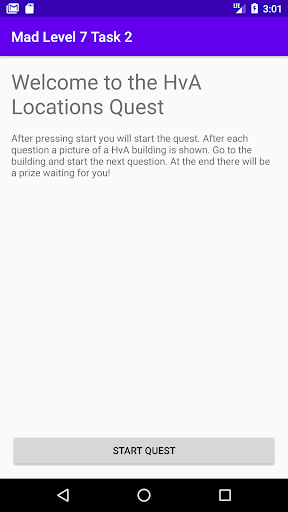
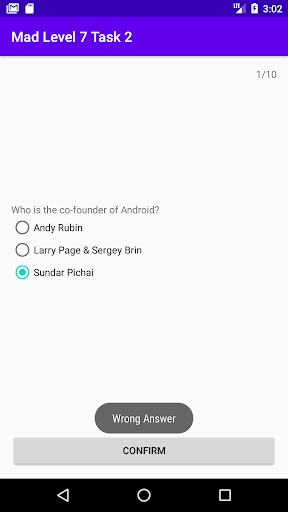
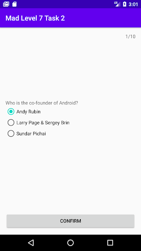
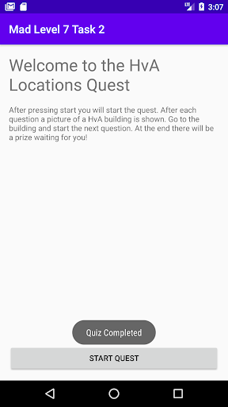

author: HvA
summary: MAD Level 7 - Task 2
id: level7-task2
tags: apps
categories: Apps
status: Published
feedback link: https://github.com/pmeijer-hva/mad-codelabs/issues
analytics account: UA-180951198-1

# MAD Level 7 - Task 2

## Overview

### What we are building

We will be building an application in which you will embark on a quest throughout various HvA locations, each location
will provide a new challenge which will have to be completed to continue on to the next.

The end result will have to look something like this: 

&emsp;&emsp; 

&emsp;&emsp; 

Positive
: In the example screens there are no images/texts of buildings shown. This is not so user friendly. Be creative and make sure the user does know 
which building he or she is at. You don't have to build GPS functionalities.

### Requirements

The app has the following requirements:

- A set of questions should be loaded and displayed in order from Firestore.
- A user will start the quest from the homescreen.
- When the quest is started first a question is displayed.
- Show the next question when the user clicks on the “confirm” if the answer is correct, otherwise show a toast message
  telling the user their answer is wrong.
- Make use of Navigation Components and ViewModels.

### Solution

Now, you are on your own. There is no solution provided. Good Luck!

Positive
: Push the app to your GitLab when it’s finished!